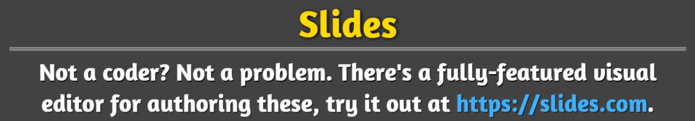
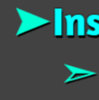
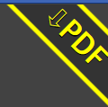
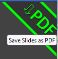
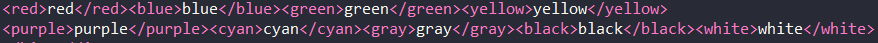
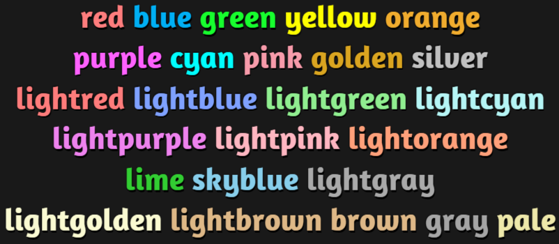
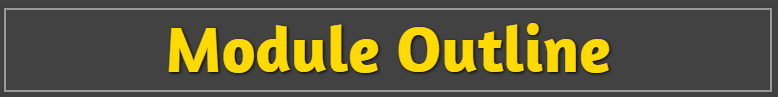

# **Daniel's Teaching Materials**

This repository hosts the teaching material I created based on the HTML slide framework reveal.js to fit my own requirements. For more information, please refer to [RevealJS](https://revealjs.com).

# Access the Demos

I make **2** versions of the same source code: one with university internal access and the other with public access.

- Try to visit the [University Version](https://pages.github.falmouth.ac.uk/Daniel-Zhang/UK_Teaching/).

- If you have difficulties of visiting the above link that requires an organisation account, please try this [Public Version](https://libralibra.github.io/UK_Teaching/).

---

## ToDos:
- [ ] fix the pre/code alignment problem (probably caused by css, data-line-number)
- [ ] find a good way of showing all slides in overview mode (**requires modification of the original javascript in node.js environment and rebuild the whole package**)
- [ ] simplify the code for deployment

## Extras:

- [x] add extra plugins: menu, chalkboard, extra controls
    * [x] More controls:
        - [x] menu (1st icon) to show slide list, change theme, change transition style
        - [x] chalkboard for annotating and drawing
        - [x] customcontrols for toggling blackout, fullscreen, overview, speakernote, and showing help
        - [x] verticator for showing vertical shortcut for all slides in the current section
    * [x] Examples:
        - [x] merged controls with menu (from left to right: slide list, overview, speakernote, free draw, annotation, blackout, fullscreen, help): 
        - vertical indicator: 
- [x] update the default black theme for my own preference
   * [x] use AmaranthRegular font
- [x] slide heading underlined
    * [x] Slide title: 
- [x] modify list item styles and colours
    * [x] multi-level list: 
- [x] show the progress bar
- [x] add PDF download strip at the top-right corner of the slide deck
    * [x] Normal: 
    * [x] Hover: 
- [x] extra colours to enable `<red></red>, <blue></blue>, <yellow></yellow>, <green></green>, <cyan></cyan>, <purple></purple>, <orange></orange>, <gray></gray>, <white></white>, <black></black>`
    * [x] 
    * [x] 
- [x] add box around the main heading on each slide
    * [x] 
- [x] change mouse to pointer by pressing Q
- [x] add link animation (exclude slide-number and image links), which is a modified version of [this](https://jsfiddle.net/hakim/Ht6Ym/)
- [x] modify all the other themes accordingly

# Development

To extend the slide deck, check the [Demo](./demo.html) for more information.

--- 

  MIT licensed

