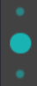

# Teaching

This repository hosts the teaching material I created based on the HTML slide framework reveal.js to fit my own requirements. For more information, please refer to [RevealJS](https://revealjs.com).

# Access the teaching version

Visit the html files in the module folders of https://pages.github.falmouth.ac.uk/Daniel-Zhang/UK_Teaching/

For a demo, try [https://pages.github.falmouth.ac.uk/Daniel-Zhang/UK_Teaching/Falmouth/COMP712/0_Induction.html](https://pages.github.falmouth.ac.uk/Daniel-Zhang/UK_Teaching/Uni/Falmouth/COMP712/0_Induction.html)

## ToDos:
- [ ] find a good way of showing all slides in overview mode (**requires modification of the original javascript in node.js environment and rebuild the whole package**)

## Extras:

1. [x] add extra plugins: menu, chalkboard, extra controls
    * [x] More controls:
        - [x] menu (1st icon) to show slide list, change theme, change transition style
        - [x] chalkboard for annotating and drawing
        - [x] customcontrols for toggling blackout, fullscreen, overview, speakernote, and showing help
        - [x] verticator for showing vertical shortcut for all slides in the current section
    * [x] Examples:
        - [x] merged controls with menu (from left to right: slide list, overview, speakernote, free draw, annotation, blackout, fullscreen, help): 
        - vertical indicator: 
1. [x] update the default black theme for my own preference
   * [x] use AmaranthRegular font
2. [x] slide heading underlined
    * [x] Slide title: 
3. [x] modify list item styles and colours
    * [x] multi-level list: 
4. [x] show the progress bar
5. [x] add PDF download strip at the top-right corner of the slide deck
    * [x] Normal: 
    * [x] Hover: 
6. [x] extra colours to enable `<red></red>, <blue></blue>, <yellow></yellow>, <green></green>, <cyan></cyan>, <purple></purple>, <orange></orange>, <gray></gray>, <white></white>, <black></black>`
    * [x] 
    * [x] 
7. [x] change mouse to pointer by pressing Q
8. [x] add link animation (exclude slide-number and image links), which is a modified version of [this](https://jsfiddle.net/hakim/Ht6Ym/)
9. [x] modify all the other themes accordingly

--- 

  MIT licensed

