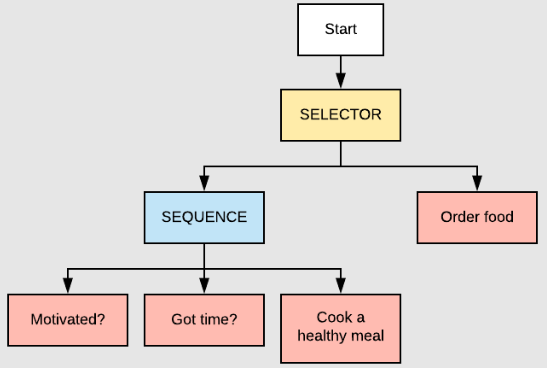
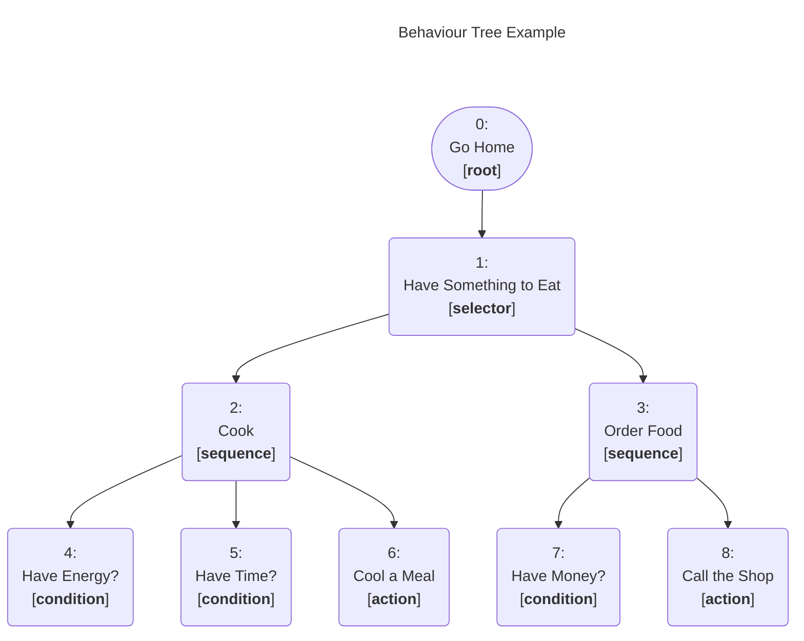
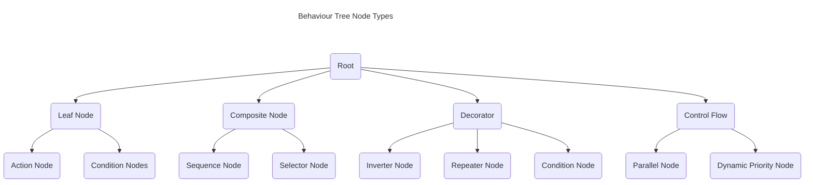
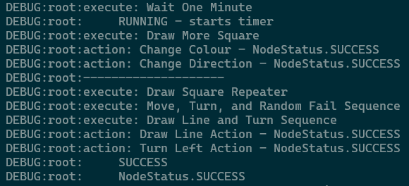
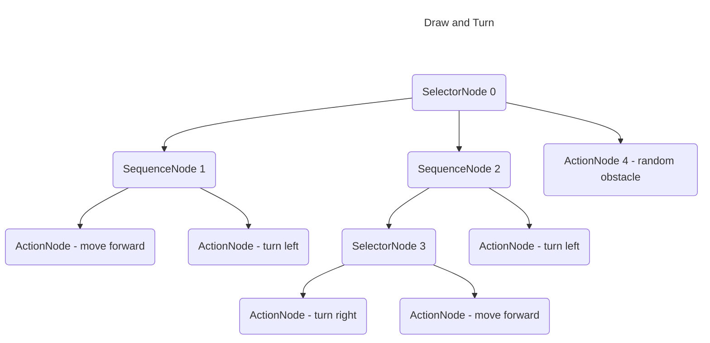
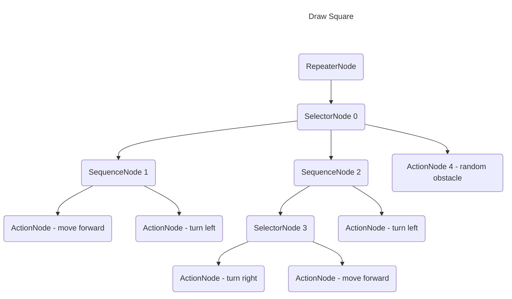
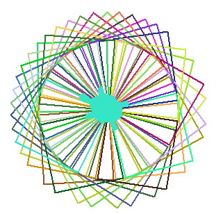

<style>
    table, tr, td { border: none !important; }
</style>
<table align="left">
    <tr>
        <td></td>
        <td> </td>
    </tr><br>
</table><br><br>

# COMP712: Classical Artificial Intelligence 

# Workshop: Understanding Behaviour Trees (BTs) in Game Development

Dr Daniel Zhang @ Falmouth University\
2023-2024 Study Block 1


*source: https://blog.zhaytam.com/img/BehaviorTreeExample.png*

<div id="top"></div>

# Table of Contents
- [COMP712: Classical Artificial Intelligence](#comp712-classical-artificial-intelligence)
- [Workshop: Understanding Behaviour Trees (BTs) in Game Development](#workshop-understanding-behaviour-trees-bts-in-game-development)
- [Table of Contents](#table-of-contents)
- [Introduction](#introduction)
  - [One Example](#one-example)
  - [BT Nodes](#bt-nodes)
- [Implement Node Behaviours](#implement-node-behaviours)
  - [Node Status](#node-status)
  - [Define a `Leaf` Node](#define-a-leaf-node)
  - [Define a `Composite` Node](#define-a-composite-node)
    - [`Sequence` Node](#sequence-node)
    - [`Selector` Node](#selector-node)
- [Experiment](#experiment)
  - [The Repository](#the-repository)
  - [Your Task](#your-task)
    - [Task 1: Running the demo](#task-1-running-the-demo)
    - [Task 2: Draw a line and turn left](#task-2-draw-a-line-and-turn-left)
    - [Task 3: Draw a square](#task-3-draw-a-square)
    - [Task 4: Exploring Other Branches](#task-4-exploring-other-branches)
    - [Task 5: Draw the Kaleidoscope](#task-5-draw-the-kaleidoscope)
- [Further Reading](#further-reading)
  - [Game Development](#game-development)
  - [Game AI Pro](#game-ai-pro)


# Introduction
<a href="#top">Top</a>

Behaviour Trees, or BTs, are a powerful tool in the realm of game development and artificial intelligence. They provide a structured way to define the behaviour of characters and entities in a game. Think of them as a roadmap for decision-making, allowing entities to react dynamically to changing circumstances. 

Initially, BTs found application in the gaming industry to depict the behaviour of NPC characters. Over time, their utilisation expanded to various domains, including robotics. Essentially, a BT is a hierarchical structure comprising predefined node types (root, control flow, and execution) designed to illustrate the behaviour of a system or entity. Each node yields outcomes of either `Success`, `Failure`, or `Running`.

## One Example
<a href="#top">Top</a>

Let's have a look of the image showing at the beginning of this file. After a long day of study, you are hungry. What you might do in this scenario can be illustrated as a BT, like the following one:



By analysing this BT, you can easily understand the intended model. The underlying logic of this tree is straightforward — the primary objective is to acquire something to eat. The options are either to order fast food or prepare a meal independently. Typically, you won't pursue both simultaneously. This implies that only one of the branches under block `1` can lead to success. Opting to cook for yourself (block `2`) requires both motivation and time to prepare a meal, while ordering food (block `3`) only requires having money in your pocket.

## BT Nodes
<a href="#top">Top</a>

BT consists of various types of nodes that work together to model the decision-making and behaviour of entities in games or other systems. Each node type serves a specific function within the tree. Here's an overview of common Behaviour Tree nodes:

**1. Root Node:**
   - **Function:** Initiates the decision-making process.
   - **Description:** The root node is where the evaluation of the behaviour tree begins. It triggers the execution of the tree and directs the flow based on the type of root node used (e.g., `Selector` or `Sequence`).

**2. Composite Nodes:**
   - **Function:** Control the flow of execution by combining multiple child nodes.
   - **Description:** Composite nodes determine how child nodes are evaluated and their results aggregated.
     - **`Sequence` Node:**
       - Executes child nodes in order until one fails.
       - Fails if any child fails; succeeds only if all children succeed.
     - **`Selector` Node:**
       - Executes child nodes in order until one succeeds.
       - Succeeds if any child succeeds; fails only if all children fail.
  
**3. Leaf Nodes:**
   - **Function:** Perform actions or check conditions.
   - **Description:** Leaf nodes are where the actual behaviour or actions are defined.
     - **`Action` Node:**
       - Performs a specific action or behaviour.
     - **`Condition` Node:**
       - Checks a condition and returns either Success or Failure.

**4. Decorator Nodes:**
   - **Function:** Modify the behaviour of child node. Decorator node can only have a single direct child.
   - **Description:** Decorator nodes add conditions or constraints to child node.
     - **`Inverter` Node:**
       - Inverts the result of its child node (Success becomes Failure and vice versa).
     - **`Repeater` Node:**
       - Repeats the execution of its child node a specified number of times.

**5. Control Flow Nodes:**
   - **Function:** Manage the flow of execution based on conditions.
   - **Description:** Control flow nodes are often used within composite nodes.
     - **`Parallel` Node:**
       - Executes child nodes in parallel, with different policies for success or failure.
     - **`Dynamic Priority` Node:**
       - Dynamically adjusts the priority of child nodes based on their runtime conditions.

> Note: The above classification is just one way of categorising BT nodes. Someone may view `Decorator` nodes as a subtype of `Composite` nodes — it depends on a specific definition of `composite` nodes.

The first three types of nodes, namely `root`, `composite`, and `leaf` nodes, are the most commonly used ones for representing behaviors. The last two are particularly valuable for introducing diversities to the tree structure and behaviour flows. These nodes can be illustrated as the structure below. 



# Implement Node Behaviours
<a href="#top">Top</a>

Understanding how these nodes interact and influence each other is crucial for designing effective Behaviour Trees that accurately represent the desired behaviour of entities within a system. The arrangement and combination of these nodes determine the complexity and adaptability of the behaviour modelled by the tree.

## Node Status
<a href="#top">Top</a>

In a BT, each node, whether it's a `leaf` node or a `composite` node, can have one of three statuses: `Success`, `Running`, or `Failure`. These statuses are crucial for the execution of the BT, determining the outcome of each node's execution. Here's a brief explanation of each status:

- **`Success`**:

    - Indicates that the node has successfully completed its task or condition.
        - For `leaf` nodes, it often means the action was performed successfully.
        - For `composite` nodes, it depends.

- **`Running`**:

    - Indicates that the node is still in the process of execution.
    - This status is often used when an `action` or `condition` takes more than one tick to complete.
    - Running status helps in managing the flow of the behaviour tree over multiple frames or time steps.

- **`Failure`**:

    - Indicates that the node could not successfully complete its task or condition.
        - For `leaf` nodes, it often means the action failed or the condition was not met.
        - For `composite` nodes, it depends.

## Define a `Leaf` Node
<a href="#top">Top</a>

A `leaf` node, as implied by its name, represents the final layer of any tree. In simpler terms, no child nodes are attached to any `leaf`. Depending on the type of a `leaf` node, it can either execute an `action` or assess a `condition`. These nodes are typically user-defined as they vary based on usage and context. `Action` nodes carry out specific actions and provide a status of success or failure. `Condition` nodes, on the other hand, simply return `True` or `False` based on the queried conditions.

## Define a `Composite` Node
<a href="#top">Top</a>

As introduced above, `composite` nodes are nodes that contain one or more children and dictate how they are run and when to stop. There are 2 types of `composite` nodes: `sequence` and `selector`. We'll look at them one after the other.

### `Sequence` Node
<a href="#top">Top</a>

A `sequence` node is a type of composite node that orchestrates the execution of its child nodes in a sequential manner. The `sequence` node ensures that each child node is executed in order, one after the other. It follows the "`sequence until failure`" logic.

Here's how a `sequence` node typically works:

- **Execution Flow**:

    - It starts by executing its first child node.
    - If the first child node returns "`Success`", it moves on to the next child node in the sequence.
    - If any child node returns "Failure," the `sequence` node itself returns "`Failure`" ***without*** executing subsequent child nodes.
    - If all child nodes return "`Success`", the `sequence` node returns "`Success`".

- **Use Case**:

    - Useful when you want a series of actions or conditions to be satisfied in a specific order.

- **Example**:

    - Suppose you have a game character with a `sequence` node representing the actions to perform when searching for an item:
        - Child Node 1: Check if the item is in sight.
        - Child Node 2: Move towards the item.
        - Child Node 3: Pick up the item.
    - In this example, the `sequence` node ensures that each step is executed sequentially, and if any step fails, the entire sequence fails.

### `Selector` Node
<a href="#top">Top</a>

In a BT, a `Selector` node is another type of composite node, and its purpose is to handle a set of child nodes in a way that allows for flexibility in decision-making. The `Selector` node follows the "`selector until success`" logic.

Here's how a `Selector` node typically works:

- **Execution Flow:**
    - It starts by executing its first child node.
    - If the child node returns "`Success`," the `Selector` node itself returns "`Success`" without executing subsequent child nodes.
    - If the child node returns "`Failure`", it moves on to the next child node in the sequence.
    - If all child nodes return "`Failure`", the `Selector` node itself returns "`Failure`".

- **Use Case:**
    - Useful when you want to try multiple actions or conditions in sequence until one succeeds.
    - It provides a fallback mechanism, trying alternatives if the first choice fails.

- **Example:**
    - Suppose you have a game character with a `Selector` node representing different ways to find a key:
        - Child Node 1: Check if the key is in the character's inventory.
        - Child Node 2: Search the nearby room for the key.
        - Child Node 3: Ask a nearby NPC for the key.
    - In this example, the `Selector` Node returns "`Success`" as soon as one of the child nodes succeeds. If the first choice fails, it tries the next one until a successful action is found.

# Experiment
<a href="#top">Top</a>

## The Repository
<a href="#top">Top</a>

The repository below contains the template code of an Behaviour Tree implementation in Python.

**Fork the repository** (NOT clone!) and work on your fork. This will enable you to submit a pull request in the end.

> **[https://github.falmouth.ac.uk/Daniel-Zhang/COMP712-Behaviour-Tree.git](https://github.falmouth.ac.uk/Daniel-Zhang/COMP712-Behaviour-Tree.git)**

## Your Task
<a href="#top">Top</a>

In the folder, you'll find various files, including `demo.pyc`, a compiled version providing a glimpse into the functionality of a complete behaviour tree.

> **Hint**:
> Implement your code by searching lines of 
> 
> ```# >>>>>>>> YOUR CODE HERE <<<<<<<<<<```
>
> You may want to write helper functions as you need.

### Task 1: Running the demo

Upon forking the repository, you can explore the completed demo by executing the command:

> `python demo.pyc`

This command will trigger the display of informative output in the command line window, illustrating the running process, as shown in the screenshot below.



**The Crazy Turtle**

Imagine a turtle slowly crawling along the beach at a constant speed, persistently moving forward without specific instructions to turn left or right. As it moves, it leaves behind a trail of colors, depicting the path it follows.

However, one day, this turtle goes off script and attempts fervently to draw squares. Let's split this ambitious task into pieces: (`A`) draw a line; (`B`) draw a square; and \(`C`) draw many squares.

While instructing the turtle to move forward facilitates drawing a simple line, additional nodes has been added to get acquainted with various BT node types, as demonstrated in the BT below.



### Task 2: Draw a line and turn left
<a href="#top">Top</a>

- open the template file `bt_turtle.py` and complete the implementation.
  - compare and analyse your implementation according to the BT tree
  - make sure the code runs without any problem 
  - make sure the turtle draws a line on screen then turn left (90° anti-clockwise)

**Draw a Square**

If drawing a line poses no issues, creating a square requires only a few additional lines of code in your implementation.

- We'll employ two methods to draw the square:
  - Think about how can you draw a square if you have the code to draw a line ready
  - Utilising a `for` loop:
    - Given the successful drawing of a line (as noted in the turn left action in task 2), the square can be rendered by simply encapsulating the entire BT within the `for` loop.
  - Leveraging the `RepeaterNode`:
    - By introducing a new `RepeaterNode` as the parent of the current root, set to repeat a certain number of times, the turtle will draw a line and subsequently turn left for several times to complete the square.
    - This integration of the new `RepeaterNode` enhances code comprehension significantly, as shown below.



### Task 3: Draw a square
<a href="#top">Top</a>

- Finalize the square drawing implementation utilizing a for loop.
- Complete the definition of the RepeaterNode class and integrate it into the process of drawing the square.
- Optionally, include an additional header SelectorNode to choose between the two methods. If one method fails, the other can be attempted to ensure proper drawing of the square.

**Force to Visit the Other Branches**

SelectorNode 0, to consistently trigger the first child branch, SequenceNode 1. Consequently, the other two child branches — SequenceNode 2 and ActionNode 4 — remain unvisited.

**Q**: How can you modify the tree to explore the other branches?

One possible approach (other methods may exist) involves adjusting the turn value of the move_forward function from return NodeStatus.SUCCESS to return random.choice([NodeStatus.SUCCESS, NodeStatus.FAILURE]). This change means that the action will randomly return either SUCCESS or FAILURE after drawing a line.

### Task 4: Exploring Other Branches
<a href="#top">Top</a>

- Analyse the BT to observe the impact of this change on its behaviour.
- Execute your code, which successfully draws a square, to observe the outcome.
- Consider the necessary alterations to the tree to enable drawing the square once more.
- Adjust your code to reflect the newly devised modifications.

**Crazy Turtle Going Mad**

The turtle starts off by drawing squares but then goes on an unpredictable journey. Over time, its movements transform the drawn shapes into a mesmerising Kaleidoscope pattern!



Now, you have a working BT that can draw a square on screen. Looking at the Kaleidoscope shown above, try to make alterations to your existing BT to draw a similar shape using your code.

### Task 5: Draw the Kaleidoscope
<a href="#top">Top</a>

- Think about what types of new branches/nodes need to be introduced
- What changes are needed for the tree structure -- where to place those new nodes?
- Implement the changes to your code and run it to get the drawings
  - draw the proper pattern
  - each square has a unique colour
  - turtle draws each square at a different speed
- You may make use of the provided helper functions and node types (WaitNode)

**Note:**
> You can submit a pull request to the original repository to showcase your work if you like.

# Further Reading
<a href="#top">Top</a>

## Game Development
  - [behavior-trees-in-unreal-engine](https://docs.unrealengine.com/5.1/en-US/behavior-trees-in-unreal-engine/)
  - [behavior-tree-in-unreal-engine--quick-start-guide](https://docs.unrealengine.com/5.1/en-US/behavior-tree-in-unreal-engine---quick-start-guide/)
  - [behavior-trees-for-ai-how-they-work](https://www.gamedeveloper.com/programming/behavior-trees-for-ai-how-they-work)

## Game AI Pro
  - [Template_Tricks_for_Data-Driven_Behavior_Trees](http://www.gameaipro.com/GameAIProOnlineEdition2021/GameAIProOnlineEdition2021_Chapter13_Template_Tricks_for_Data-Driven_Behavior_Trees.pdf)
  - [Overcoming_Pitfalls_in_Behavior_Tree_Design](http://www.gameaipro.com/GameAIPro3/GameAIPro3_Chapter09_Overcoming_Pitfalls_in_Behavior_Tree_Design.pdf)
  - [Building_Utility_Decisions_into_Your_Existing_Behavior_Tree](http://www.gameaipro.com/GameAIPro/GameAIPro_Chapter10_Building_Utility_Decisions_into_Your_Existing_Behavior_Tree.pdf)
  - [Simulating_Behavior_Trees](http://www.gameaipro.com/GameAIPro/GameAIPro_Chapter08_Simulating_Behavior_Trees.pdf)
  - [Real-World_Behavior_Trees_in_Script](http://www.gameaipro.com/GameAIPro/GameAIPro_Chapter07_Real-World_Behavior_Trees_in_Script.pdf)
  - [The_Behavior_Tree_Starter_Kit](http://www.gameaipro.com/GameAIPro/GameAIPro_Chapter06_The_Behavior_Tree_Starter_Kit.pdf)
  - [Combining_Scripted_Behavior_with_Game_Tree_Search_for_Stronger_More_Robust_Game_AI](http://www.gameaipro.com/GameAIPro3/GameAIPro3_Chapter14_Combining_Scripted_Behavior_with_Game_Tree_Search_for_Stronger_More_Robust_Game_AI.pdf)


