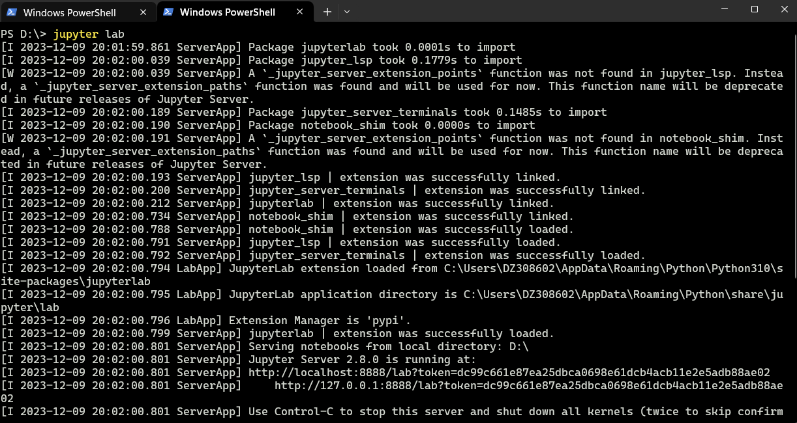
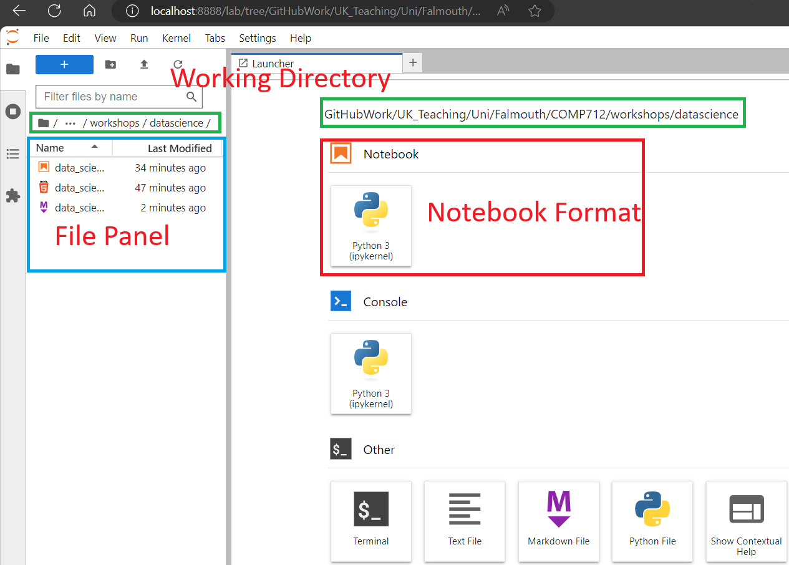

# COMP712 Classical Artificial Intelligence

# Workshop: Data Science using Python

Dr Daniel Zhang @ Falmouth University\
2023-2024 Study Block 1

<div id="top"></div>

# Table of Contents
- [COMP712 Classical Artificial Intelligence](#comp712-classical-artificial-intelligence)
- [Workshop: Data Science using Python](#workshop-data-science-using-python)
- [Table of Contents](#table-of-contents)
- [Introduction](#introduction)
- [Preparation](#preparation)
- [JupyterLab Notebook](#jupyterlab-notebook)
- [The Repository](#the-repository)
- [The Notebook](#the-notebook)
- [Note:](#note)


# Introduction

[Top](#top)

Welcome to this comprehensive workshop on Data Science using Python!

In this session, we'll delve into the essential Python libraries for scientific computation and machine learning: `NumPy`, `Matplotlib`, and `Pandas`. These powerful tools will empower us to handle data manipulation, visualisation, and analysis, laying the foundation for building sophisticated machine learning models.

Apart from familiarising yourselves with these libraries, you will write your code in `JupyterLab` - the integrated interactive development environment.

# Preparation 

[Top](#top)

To work with Jupyter notebook, I would assume you have all the necessary libraries and tools installed successfully. For instance, you should have the following libraries on the machine you are working on:

- `python`
- `numpy`
- `matplotlib`
- `scipy`
- `pandas`
- `jupyterlab`

If any of the software or libraries are not installed, please follow the instructions below to get them installed. 

0. Download and install python from [Python Website](https://www.python.org/)

1. Use Python's package manager, `pip`, to install the required libraries. Open your terminal or command prompt and run the following command:

 ```bash
    pip install numpy
    pip install matplotlib
    pip install scipy
    pip install pandas
```

2. You can also combine them together as one command for installation:

```bash
   pip install numpy matplotlib scipy pandas
```

3. And, more importantly, install `JupyterLab` using the command:
   
```bash
   pip install jupyterlab
```

4. If `JupyterLab` has been installed properly, you have two options to run the notebook:
   
   1. Start a command window and type 
   ```bash
      jupyter lab
   ```
    , which will initiate the jupyter server and automatically open a browser to the current working folder. 
   
   2. Run the notebook directly within Visual Studio Code, utilising the Jupyter extension that supports notebook editing and previewing.

# JupyterLab Notebook
[Top](#top)

The following screenshot displays the command window output information while starting JupyterLab.


*Fig. 1: Starting JupyterLab in Command Window*

If there are no issues during this process, a new browser tab will open automatically, displaying the GUI.


*Fig. 2: JupyterLab GUI*

As depicted in the screenshot above, the file panel lists all the files in your current working directory. The main area on the right provides options to create various file types, including `notebook`, `console python file`, `pure text file`, `markdown`, and others. For this session, you will work with `notebook`.

You don't need to create a new notebook manually as a template has been provided in the repository of this workshop.

# The Repository
[Top](#top)

The repository below contains the Jupyter Notebook with examples and exercises for this session.

**Fork the repository** (NOT clone!) and work on your fork. This will enable you to submit a pull request at the end (if needed).

> [**https://github.falmouth.ac.uk/Daniel-Zhang/COMP712-DataScience.git**](https://github.falmouth.ac.uk/Daniel-Zhang/COMP712-DataScience.git)

# The Notebook
[Top](#top)

There's only one `.ipynb` file in the repository, which is self-explanatory. Now, switch to the notebook using one of the methods introduced above.

# Note: 
> **You don't need to submit any code for this workshop**


