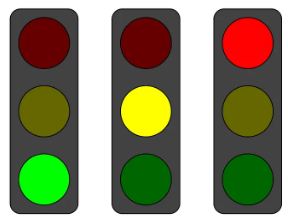
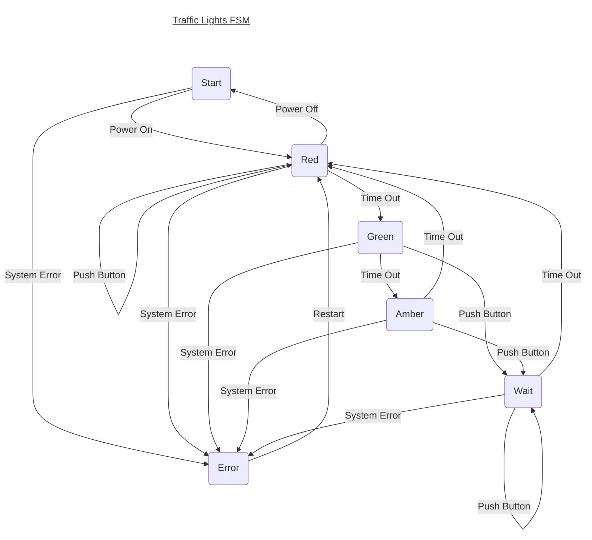
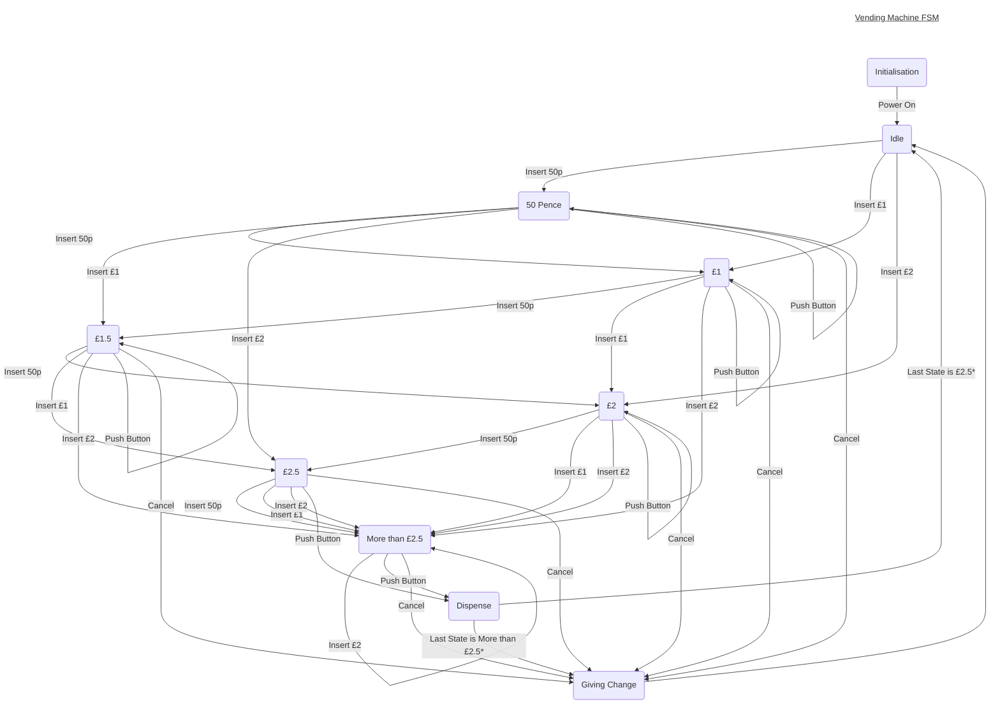

<table align="left">
    <tr>
        <td></td>
        <td> </td>
    </tr> 
</table>  

# COMP712: Classical Artificial Intelligence 
# Workshop: Finite State Machine (FSM)

Dr Daniel Zhang @ Falmouth University\
2023-2024 Study Block 1

Table of Contents
- [COMP712: Classical Artificial Intelligence](#comp712-classical-artificial-intelligence)
- [Workshop: Finite State Machine (FSM)](#workshop-finite-state-machine-fsm)
- [Introduction](#introduction)
- [Understanding Finite State Machines](#understanding-finite-state-machines)
  - [Components of a Finite State Machine](#components-of-a-finite-state-machine)
  - [A Practical Example: Traffic Lights FSM](#a-practical-example-traffic-lights-fsm)
  - [Adjacency List](#adjacency-list)
- [Your Task](#your-task)
  - [1. Traffic Light FSM](#1-traffic-light-fsm)
    - [The Repository](#the-repository)
    - [The Code Structure](#the-code-structure)
    - [**Exercise**](#exercise)
  - [2. Vending Machine FSM](#2-vending-machine-fsm)
    - [**Exercise**](#exercise-1)
- [Submit Your Code](#submit-your-code)
- [Further Reading](#further-reading)

# Introduction
<a href="#top">Top</a>

Finite State Machines (FSMs) are powerful tools in computer science and programming. They provide a structured way to model complex systems, making them an essential concept for any aspiring programmer or computer scientist. In this session, we will delve into the world of Finite State Machines, exploring their fundamental principles and applications. We'll also demonstrate how to implement FSMs using Python, a versatile and popular programming language.

# Understanding Finite State Machines
<a href="#top">Top</a>

At its core, a Finite State Machine is a mathematical model that describes a system's behaviour by dividing it into a finite number of states, transitions between these states, and the conditions triggering these transitions. FSMs are excellent for representing systems with distinct modes or conditions. They are widely used in various domains, such as robotics, gaming, natural language processing, and more.

## Components of a Finite State Machine
<a href="#top">Top</a>

Before we delve into Python programming, let's understand the essential components of an FSM:

- **`States`**: These represent the distinct conditions or modes of the system. For instance, in a traffic light system, the states could be 'Green,' 'Yellow,' and 'Red.'

- **`Transitions`**: These define the conditions under which the system switches from one state to another. Transitions are often triggered by specific `Events` (_It is also considered as **`Conditions`** or **`Signals`**_) or criteria.

- **`Actions`**: Actions are tasks or operations performed when a transition occurs. They can range from simple outputs to complex calculations.

- **`Initial State`**: This is the starting point of the FSM, where the system begins.

- **`Final State`**: The final state indicates the end of a process or scenario.

**Note**: In certain FSMs, `transitions` and `actions` may be very similar, as no additional actions are required beyond state transitions.

## A Practical Example: Traffic Lights FSM
<a href="#top">Top</a>

Let's consider a simple example of a traffic lights model. The FSM for the traffic lights could have states like '`Red`', '`Green`', '`Amber`', etc. Signals occur as the time elapses or pedestrians pushed the button for crossing. The transition operations need to change the lights' states.

The state diagram of the Traffic Light FSM is illustrated below.

When comparing the state transition diagram above to the definition in the previous section, we can describe the Traffic Light FSM as follows:

- **`State`**: The Traffic Light FSM encompasses the states of `Start`, `Red`, `Green`, `Amber`, `Wait`, and `Error`.
- **`Signals`**: The FSM responds to signals including `Power On`, `Power Off`, `Time Out`, `Push Button`, `Restart`, and `System Error`.
- **`Actions`**: State transitions between different states.
- **`Initial State`**: The initial state for this FSM is `Start`.
- **`Final State`**: The determination of the final state is context-dependent. For instance, `Error` might be considered the final state, although the `Restart` signal can trigger a transition to change the light to the `Red` state. Multiple states can be included in the final state set to terminate the FSM at various points.

## Adjacency List
<a href="#top">Top</a>

In practical applications, an adjacency list becomes particularly useful when the state diagram grows too complex to explore easily. It serves as a collection of unordered lists, primarily used to represent a finite graph. Each unordered list within an adjacency list describes the set of transitions originating from a specific vertex in the graph. This representation is one of several commonly employed methods for graph representation in computer programming.

For relatively simple state machines, explicitly writing out adjacency lists might seem unnecessary. However, for more intricate systems, you'll likely find yourself creating a form of it, making it a valuable practice.

In the context of this specific discussion, we won't adhere to the precise definition of an adjacency list, as we're not describing a "**set of neighbours**" but rather a "**set of transitions**", as shown in the table below.

| State   | Transition to                 |
| ------- | ----------------------------- |
| `Start` | `Red` or `Error`              |
| `Red`   | `Start` or `Green` or `Error` |
| `Green` | `Amber` or `Wait` or `Error`  |
| `Amber` | `Red` or `Wait` or `Error`    |
| `Wait`  | `Red` or `Error`              |
| `Error` | `Red`                         |

# Your Task
<a href="#top">Top</a>

## 1. Traffic Light FSM
<a href="#top">Top</a>

This task is to implement the FSM for this Traffic Lights model according to the state diagram above. 

### The Repository
<a href="#top">Top</a>

The repository below contains the template code of an FSM implementation in Python.

**Fork the repository** (NOT clone!) and work on your fork. This will enable you to submit a pull request in the end.

> [**https://github.falmouth.ac.uk/Daniel-Zhang/COMP712-Finite-State-Machine.git**](https://github.falmouth.ac.uk/Daniel-Zhang/COMP712-Finite-State-Machine.git)

### The Code Structure
<a href="#top">Top</a>

The repository contains 3 file.

- `fsm.py`: it is the implementation of a simple FSM with all the components introduced above except `Actions`, which is the task for you to implement in a separate script during this workshop. _This design will make sure the `FSM` model response to any model if the `transitions` and `actions` are defined properly somewhere_.
- `fsm_demo.py`: it is a template python script that you are going to working on.
- `fsm_example.pyc`: it is an example of completed implementation of Traffic Light FSM, which can be simulated by running `python fsm_example.pyc`
   - It was compiled using `python 3.12.0`, which should work with all python `3.x` version. Please let the tutor know if it doesn't work and a newer version will be updated.

### **Exercise**
<a href="#top">Top</a>

- complete the implementation of the Traffic Lights FSM
  - make sure it works as expected
  - increase the number of actions to simulate the process longer
  - add one or more states to the model

## 2. Vending Machine FSM
<a href="#top">Top</a>

This task is to implement a Vending Machine FSM that sells Coca to the user. This special machine only accepts 50p, £1, and £2 coins and each can of Coca costs £2.5 (a little bit expensive :-)). Additionally, we will assume the vending machine never runs out of stock for economic reasons. Similarly, it never runs out of change. This example is a perfect computational problem to model with a finite state machine! 

The state diagram is illustrated below.

### **Exercise**
<a href="#top">Top</a>

- Work out the adjacency list to help you understand the diagram if necessary.
- Create a new Python file (`.py`), either inherit from the FSM model defined in `fsm.py` or start from scratch.
- Implement the Vending Machine FSM to meet the requirements outlined in the state diagram.

# Submit Your Code
<a href="#top">Top</a>

Feel free to submit a pull request to the original repository to showcase your work if you wish to share your solution with others.

# Further Reading
<a href="#top">Top</a>

- [Wiki - Finite State Machine](https://www.wikiwand.com/en/Finite-state_machine)
- [Python State Machine](https://python-statemachine.readthedocs.io/en/latest/index.html)
- [An implementation of FSM](https://github.com/fgmacedo/python-statemachine)