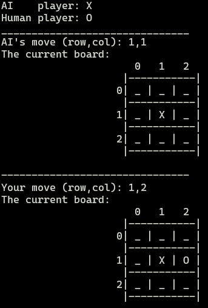
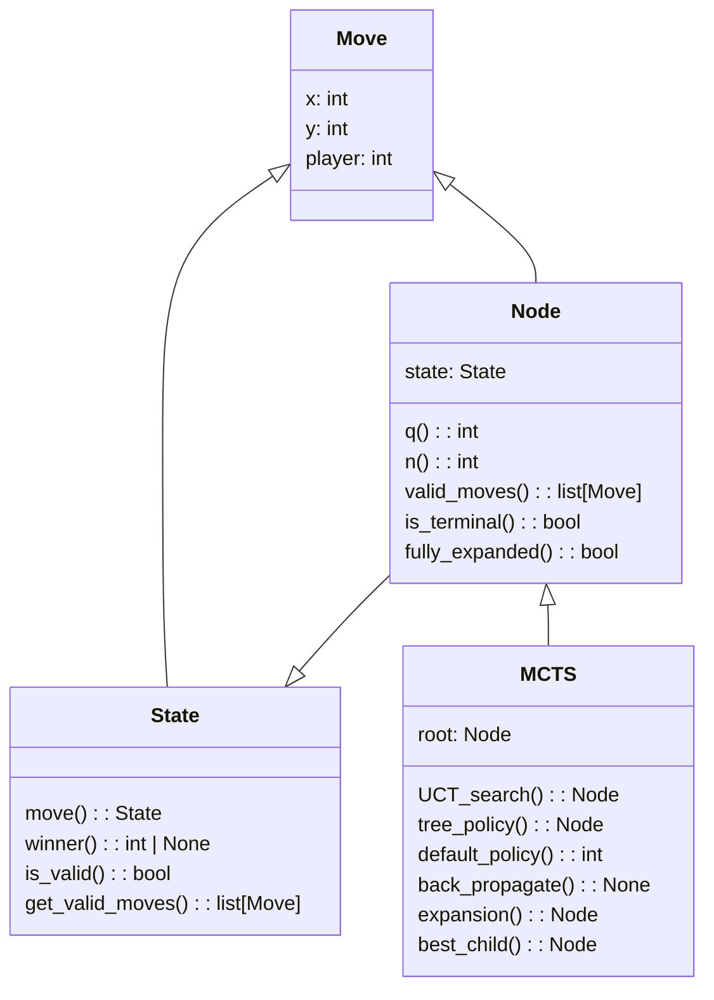

# COMP712: Classical Artificial Intelligence 
# Workshop: Monte Carlo Tree Search (MCTS)

Dr Daniel Zhang @ Falmouth University\
2023-2024 Study Block 1


<div id="top"></div>

# Table of Contents
- [COMP712: Classical Artificial Intelligence](#comp712-classical-artificial-intelligence)
- [Workshop: Monte Carlo Tree Search (MCTS)](#workshop-monte-carlo-tree-search-mcts)
- [Table of Contents](#table-of-contents)
- [Introduction to MCTS](#introduction-to-mcts)
- [The Details of MCTS Algorithm](#the-details-of-mcts-algorithm)
  - [UCT](#uct)
  - [Tree Policy](#tree-policy)
  - [Expansion](#expansion)
  - [Default Policy (Random Simulation)](#default-policy-random-simulation)
  - [Back Propagation](#back-propagation)
  - [Action of Move](#action-of-move)
- [Your Task](#your-task)
  - [The Repository](#the-repository)
  - [Task 1: run the demo](#task-1-run-the-demo)
  - [The Code Structure](#the-code-structure)
  - [Task 2: implement the missing functions](#task-2-implement-the-missing-functions)
  - [Task 3: play the game to verify your implementation](#task-3-play-the-game-to-verify-your-implementation)
- [Further Reading:](#further-reading)

**We've covered MCTS theory and its detailed algorithm in our lectures. In this workshop, your task is to implement your own MCTS algorithm to play the classic game Tic-Tac-Toe.**

# Introduction to MCTS
[Top](#top)

Various tree search algorithms exist. For shallow trees where we can calculate winning or losing probabilities for each node exhaustively, the simplest strategy, called the '`minimax`' algorithm, suffices. Beginning from the leaf nodes, choosing max for our turn and min for the opponent's assumes the opponent also employs the '`minimax`' strategy, reaching a `Nash equilibrium` in game theory.

This strategy works for small search spaces. However, MCTS addresses larger search spaces where calculating subtree values isn't feasible. It's a tree-based search algorithm balancing `exploration` and `exploitation`, effective in vast search spaces.

Efficiency in MCTS involves considering exploration, exploitation, and avoiding local optima. The classic `UCB (Upper Confidence Bounds)` algorithm prioritises unexplored child nodes during selection. If the node is fully expanded, selection relies on known rewards. A child node's likelihood of winning inversely relates to its play frequency. A high average reward increases its selection probability, favouring nodes considered more valuable. Frequent visits reduce future selection chances, encouraging exploration of nodes with fewer visits. MCTS thus explores and exploits with varying weights based on configuration, offering a heuristic method surpassing random or other strategies.

# The Details of MCTS Algorithm
[Top](#top)

As we know that MCTS algorithm consists 4 steps: selection, expansion, simulation and backpropagation. During a game, it runs through iterations to decide possible '***best***' moves for the AI if it's a single player game in which human player against AI agent. The whole process can be described by the following pseudocode, which is summarised in the paper listed in the further reading section of this workshop material. (Browne, Cameron *etc*. (2012). ***A Survey of Monte Carlo Tree Search Methods***. IEEE Transactions on Computational Intelligence and AI in Games. 4:1. 1-43. 10.1109/TCIAIG.2012.2186810. )


## UCT
<div id="uct"></div>

[Top](#top)

The primary algorithm in UCT search utilises various subroutines. Illustrated below in pseudocode, the current game state serves as the root node of the tree. It triggers the `tree_policy` subroutine to identify the node for gameplay. Once a node is selected, the game commences using the `default_policy` (i.e. random play) until the game concludes – either with a player winning or a tie. The random play's result is regarded as the reward for the selected node, and this reward is then `back_propagated` to the root. Consequently, all nodes along the path are sequentially updated. Ultimately, the best child of the selected node is identified and outputted as the action to move. 

Each node `v` represents a game node within the Monte Carlo tree. A state `s` is linked to the node to denote the game status. The action `a` to reach the current state is unnecessary, as the parent node retains this information for each node. Tracing its parent link allows retrieval of the action list detailing how the traversal from the root of the tree to the current node occurred.

```vb
function UCT_SEARCH(s0)
    create root node v0 with the state s0
    while within the computational budget do
        v ← TREE_POLICY(v0)
        w ← DEFAULT_POLICY(s(v))
        BACK_PROPAGATE(v, w)
    end
    return BEST_CHILD(v0, 0)
end
```

## Tree Policy
<div id="tp"></div>

[Top](#top)

The tree policy operates straightforwardly. While the game is ongoing, the node is expanded to return an unvisited, randomly chosen child node if it remains unexplored. However, if the node is fully expanded, it simply returns the best child node. This is because a fully expanded node has all its children visited, enabling us to determine the rewards for each child node.

```vb

function TREE_POLICY(v)
    while v is not terminal node do
        if v not fully expanded then
            return EXPAND(V)
        else
            v ← BEST_CHILD(v, Cp)
        end
    end
    return v
end
```

## Expansion
<div id="exp"></div>

[Top](#top)

During the expansion step, all children nodes of a given node are listed. This process records the associated state `s` and action `a` for each node. Then, the first unvisited one will be returned in the end.

```vb
function EXPAND(v)
    choose a` ∈ untried actions of A(s(v))
    add a new child v` to v with s(v`) = f(s(v), a`) and a(v`) = a`
    return v`
end
```

## Default Policy (Random Simulation)
<div id="dp"></div>

[Top](#top)

With a node available after the last step, a random simulation of the game can be initiated from this node. Until reaching the final state of the game, actions are randomly chosen. Ultimately, the game's result is returned as the reward for state `s`.

```vb
function DEFAULT_POLICY(s)
    while s is not terminal node do
        choose a ∈ A(s) uniformly at random
        s ← f(s, a)
    end
    return reward for state s
end
```

## Back Propagation
<div id="back"></div>

[Top](#top)

Upon determining the reward `w` of a chosen node `v`, this reward is then recursively backpropagated along the path from the root to node `v`. This recursive process updates the Monte Carlo tree information.

```vb
function BACK_PROPAGATE(v, w)
    while v is not NULL do
        N(v) ← N(v) + 1
        Q(v) ← Q(v) + w(v, p)
        v ← parent of v
    end
end
```

## Action of Move
<div id="best"></div>

[Top](#top)

Keep in mind that the above process will be executed numerous times, contingent on the simulation budget. With a comprehensive understanding or prediction of the game at the specified state following the simulations, the action involves choosing the best move available by applying the UCT equation.

```vb
function BEST_CHILD(v, c)
    for all v` ∈ children of v
        p ← argmax{Q(v`)/N(v`) + c*sqrt[2*ln(N(v)/N(v`)]}
    end
    return p
end
```

> **Note**: for better understanding of the algorithm, please refer to the lecture slides and the illustration of the process.
> 
> source: [*A Survey of Monte Carlo Tree Search Methods*](https://www.researchgate.net/publication/235985858_A_Survey_of_Monte_Carlo_Tree_Search_Methods)

# Your Task
[Top](#top)

Your objective is to implement an MCTS algorithm to engage in playing the game of Tic-Tac-Toe. In the ultimate implementation, the human player faces off against an AI agent leveraging MCTS to determine the optimal move using UCT search.

## The Repository

The linked repository below includes the template code for a Tic-Tac-Toe game. It's currently non-playable until the code is completed.

**Fork the repository** (do not clone!) and work on your fork. This will enable you to submit a pull request at the end.

> [**https://github.falmouth.ac.uk/Daniel-Zhang/COMP712-MCTS.git**](https://github.falmouth.ac.uk/Daniel-Zhang/COMP712-MCTS.git)

You'll discover two files: `demo.pyc` and `mcts_ttt.py`. The `mcts_ttt.py` file serves as the template for your work, while `demo.pyc` showcases an example gameplay once your code is completed.
 

## Task 1: run the demo
[Top](#top)

Execute the demo to experience playing the game and observe how the AI responds to human actions. 

> ```python demo.pyc```

If it runs properly, you should be able to play the game as shown in the screenshot below. 



> **Note**: This code employs the `numpy` library to streamline the implementation. If you haven't installed it yet, you can do so using the command `pip install numpy`.

## The Code Structure



- **The Classes:**
  - `Move`: Represents a move, with `x` indicating the row index, `y` indicating the column index, and `player` identifying the player making the move.
  - `State`: Stores the current game state in its `board`, a 2D square matrix. It tracks the player's turn for the next move.
  - `Node`: A node in the Monte Carlo tree, with an associated `State`. It tracks visit counts and win/lose/tie statuses from previous visits. Its `parent` information facilitates the backpropagation process by reflecting a random gameplay reward up to the tree's root.
  - `MCTS`: The primary Monte Carlo Tree Search class. **This is the main class you need to implement for this workshop**.
    - `node`: Represents the tree's root.
    - `steps`: Governs the simulation budget, determining how many game simulations occur before decision-making. The default value is `1000`.
    - `c`: The parameter in the UCT equation balancing exploration and exploitation. Default value is `1.4`.
- **The Gameplay:**
  - The AI commences the game by playing first as `X`. Subsequently, it prompts the user for input of coordinates (row, column) for `O`. Post each move, the board updates and redraws on the screen. This sequence continues until the game concludes.

## Task 2: implement the missing functions
[Top](#top)

To enable gameplay, you'll need to implement the missing functions within the `MCTS` class in the `mcts_ttt.py` file. This implementation can be divided into several smaller components:

> **Hint**: search for the following comments in the source file:
> 
> ```# YOUR CODE HERE```


- implement `UCT_search()` function

  - Refer to the [UCT_search()](#uct) pseudocode above.

- implement `tree_policy()` function

  - Refer to the [Tree_policy()](#tp) pseudocode above.

- implement `default_policy()` function

  - Refer to the [default_policy()](#dp) pseudocode above.

- implement `back_propagate()` function

  - Refer to the [back_propagate()](#back) pseudocode above.

- implement `expansion()` function

  - Refer to the [expansion()](#exp) pseudocode above.

- implement `best_child()` function

  - Refer to the [best_child()](#best) pseudocode above.

## Task 3: play the game to verify your implementation
[Top](#top)


- **Submit Your Code**
  - You can submit a pull request to the original repository to showcase your work if you like.

# Further Reading:

1. https://www.researchgate.net/publication/235985858_A_Survey_of_Monte_Carlo_Tree_Search_Methods
2. https://ai-boson.github.io/mcts/

