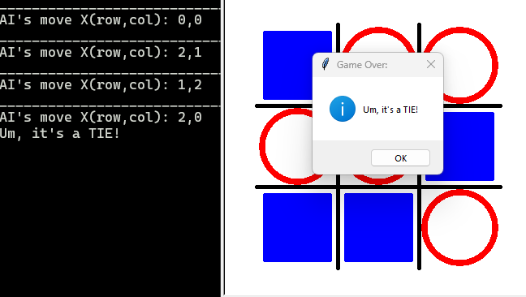

# COMP712: Classical Artificial Intelligence 
# Workshop: Unbeatable AI with Minimax

Dr Daniel Zhang @ Falmouth University\
2023-2024 Study Block 1



<div id="top"></div>

# Table of Contents
- [COMP712: Classical Artificial Intelligence](#comp712-classical-artificial-intelligence)
- [Workshop: Unbeatable AI with Minimax](#workshop-unbeatable-ai-with-minimax)
- [Table of Contents](#table-of-contents)
- [Introduction](#introduction)
- [The Game](#the-game)
- [The Game Tree](#the-game-tree)
- [Strategy Analysis: Minimax](#strategy-analysis-minimax)
- [Minimax Pseudocode](#minimax-pseudocode)
- [The Repository](#the-repository)
- [Your Task](#your-task)
  - [Task 1: Play the demo](#task-1-play-the-demo)
- [The Code Structure](#the-code-structure)
  - [Task 2: Implement the minimax algorithm](#task-2-implement-the-minimax-algorithm)
  - [Task 3: Introduce Pruning or Other Improvements](#task-3-introduce-pruning-or-other-improvements)
- [Further Reading](#further-reading)

# Introduction
[Top](#tpp)

In this session, we'll delve into the core concepts of the `Minimax` algorithm, a fundamental technique in game theory and artificial intelligence. Through practical exercises and discussions, you'll gain a comprehensive understanding of how `Minimax` works and its application in determining optimal strategies in games.

# The Game
[Top](#tpp)

We will use a very simple game **[Tic-Tac-Toe](https://www.wikiwand.com/en/Tic-tac-toe)** to demonstrate how the algorithm works. The rule is: 2 players play in turns on a 3x3 board - one marks **X** and tie other marks **O**. The one who get 3 on a row, a column, or a diagonal first wins. 

Since the game board is 3x3 small grid, the game tree is relatively simple by comparing to other large games like **[Gomoku](https://www.wikiwand.com/en/Gomoku)** and **[Go](https://www.wikiwand.com/en/Go_(game))**. Therefore, an extensive search of the game tree using the `minimax` algorithm.

# The Game Tree
[Top](#tpp)


*Source: https://www.researchgate.net/profile/Partha-Sarathi-Chakraborty-2/publication/290786914/figure/fig2/AS:408033621495809@1474294204841/Game-Tree-for-Tic-Tac-Toe_W640.jpg*

As shown in the picture above, in this partial representation of the Tic-Tac-Toe game tree, we start from the initial state of the game and showcase a few layers to demonstrate the branching structure.

**Observations**:
- First Layer:
    - Only 2 nodes are illustrated here, but theoretically, there should be 9 nodes representing all possible moves for the first player.
- Subsequent Layers:
    - Each node in the first layer should have 8 child nodes in the second layer, representing the possible moves at the second player.
    - Following this pattern, the third layer should have 7 child nodes for each node in the third layer, and so on.
- Total Nodes:
    - The total number of nodes in the tree can be calculated as `9*8*7*...*1 + 1 = 362,881`.
    - There might be duplicated nodes due to identical board configurations, but this does not alter the strategic analysis in the next section.

# Strategy Analysis: Minimax
[Top](#tpp)

The `Minimax` algorithm serves as a fundamental approach in decision-making within adversarial games like Tic-Tac-Toe. Its primary objective is to compute the optimal move for a player, taking into account potential moves by the opponent. Operating on the principle of searching through the game tree, `Minimax` assesses each possible move and assigns a value to nodes representing game states. It utilises a recursive depth-first search (`DFS`) approach to navigate the tree, evaluating each possible move and its subsequent outcomes. The algorithm assumes rational adversaries, aiming to maximize their advantage while minimizing their opponent's advantage. By simulating hypothetical gameplay, Minimax identifies the most favourable move for a player, considering all potential sequences of moves by both players until a terminal state or a predefined depth is reached.

# Minimax Pseudocode

```vb
procedure MINIMAX(state, currentPlayer)
    if state == terminal then
        return game over
    else if currentPlayer == 1 then
        bestValue = -∞
        for each possible nextState do
            v = MINIMAX(nextState, 3-currentPlayer)
            bestValue = MAX(bestValue, v)
        return bestValue
    else if currentPlayer == 2 then
        bestValue = +∞
        for each possible nextState do
            v = MINIMAX(nextState, 3-currentPlayer)
            bestValue = MIN(bestValue, v)
        return bestValue
    end if
end
```

# The Repository
[Top](#top)

The repository linked below contains the code for the Tic-Tac-Toe game.

**Fork the repository** (do not clone!) and work on your fork. This will enable you to submit a pull request at the end.

> [**https://github.falmouth.ac.uk/Daniel-Zhang/COMP712-Mimimax.git**](https://github.falmouth.ac.uk/Daniel-Zhang/COMP712-Mimimax.git)


There are 2 python files in the folder: `demo.pyc` and `minimax.py`. As usual, the `demo.pyc` is a compiled and completed version of the game. And the `minimax.py` is the template file you should be working on in this workshop.

# Your Task
[Top](#top)

## Task 1: Play the demo
[Top](#top)

You can play the game by typing the following command:

> python demo.py

**Try hard to beat the AI if you can**!

# The Code Structure
[Top](#top)

The code structure is very simply:

- `State`: This class represents the current game state, containing the board and the next player. It includes several member functions facilitating comprehension:
  - `winner`: Decorated as a property of the `State` class, it returns the winner (1 for AI, -1 for human, and 0 for a tie) if the game reaches a terminal state; otherwise, it returns `None`.
  - `move`: Executes a move in the current state and returns the new state after the action, swapping the players.
  - `undo`: Reverses the last move and swaps the players accordingly. A new state is returned after the operation.
  - `is_valid`: Verifies if a given move is valid or not.
  - `get_valid_moves`: Provides a list of all possible moves from the current state.
- Several auxiliary functions manage UI updates and coordinate calculations, which should **remain unchanged**:
  - `draw_line`: Simply draws a line from one point to another.
  - `draw_circle`: Draws a circle centred at the given point with a specified radius.
  - `draw_square`: Renders a filled square at the specified point with a defined side length.
  - `ui_init`: Initializes the board.
  - `ui_update`: Updates the game state.
  - `get_ui_pos`: Converts matrix indices `(row, column)` to UI coordinates `(x, y)`.
  - `get_mat_index`: Converts UI coordinates `(x, y)` to matrix indices `(row, column)`.
- The last two functions are awaiting completion:
  - `minimax`: This function is the primary algorithm that you'll implement, returning the AI's best move from a given state.
  - `game_play`: This function defines the main interaction of the gameplay.

## Task 2: Implement the minimax algorithm
[Top](#top)

- You will not be able to play the game until both functions are completed.
- Refer to [Further Reading](#further-reading) or lecture slides about the `minimax` algorithm.

## Task 3: Introduce Pruning or Other Improvements
[Top](#top)

- Revisit your implementation to explore potential enhancements like alpha-beta pruning or other methods to halt exhaustive searching.


**Note:**

You can submit a pull request to the original repository to showcase your work if you like.

# Further Reading

- [Online Tic-Tac-Toe Analyser](https://victorz.ca/game/t3)
- [Understanding the Game Tree with Tic Tac Toe](https://medium.com/@elissa.matsushita/understanding-the-game-tree-with-tic-tac-toe-de64fad94afd)
- [Solving Tic-Tac-Toe: Game Tree Basics](http://www.goodmath.org/blog/2008/07/30/solving-tic-tac-toe-game-tree-basics/)
