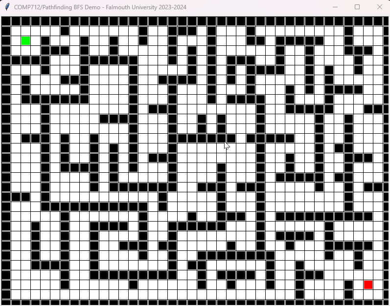

# COMP712: Classical Artificial Intelligence 

# Workshop: Pathfinding (1)

Dr Daniel Zhang @ Falmouth University\
2023-2024 Study Block 1



<div id="top"></div>

# Table of Contents
- [COMP712: Classical Artificial Intelligence](#comp712-classical-artificial-intelligence)
- [Workshop: Pathfinding (1)](#workshop-pathfinding-1)
- [Table of Contents](#table-of-contents)
- [Introduction](#introduction)
- [Breadth-First Search (BFS)](#breadth-first-search-bfs)
  - [The Pseudocode](#the-pseudocode)
- [Depth-First Search (DFS)](#depth-first-search-dfs)
  - [The Pseudocode](#the-pseudocode-1)
- [Greedy Best-First Search (GBFS)](#greedy-best-first-search-gbfs)
  - [The Pseudocode](#the-pseudocode-2)
- [The Repository](#the-repository)
  - [The Code Structure](#the-code-structure)
- [Your Task](#your-task)
  - [Task 1: run the demos](#task-1-run-the-demos)
  - [Task 2: implement `BFS`](#task-2-implement-bfs)
  - [Task 3: implement `DFS`](#task-3-implement-dfs)
  - [Task 4: implement `GBFS`](#task-4-implement-gbfs)
  - [Task 5: different number of neighbours](#task-5-different-number-of-neighbours)
- [Further Reading](#further-reading)

# Introduction
[Top](#top)

It's a very common and important problem in most of the games with a grid-like world maps. The pathfinding algorithm is crucial for the AI to move efficiently from one position to another. Most of the bugs in game productions are related to an ineffective or buggy pathfinding implementation. 

We've learnt different pathfinding algorithms during the lecture. In the following 2 workshops, you are required to revisit the theories of some of the popular pathfinding algorithms and implement them to help your understanding.

This is the part 1 of the 2 workshops: `Breadth-First Search (BFS)`, `Depth-First Search (DFS)`, and `Greedy Best-First Search (GBFS)`. 

**Note**: although 3 main tasks are assigned in this workshop, you are free to span the contents between the two workshops based on your own pace. 

# Breadth-First Search (BFS)
[Top](#top)

Breadth-first search (BFS) is an algorithm used in graph traversal and pathfinding. It systematically explores all the neighbour nodes at the present depth level before moving on to nodes at the next level of depth. It starts from a specified node and explores all its neighbours before moving to the next set of neighbours. This technique follows the principle of visiting all immediate neighbours before exploring the neighbours' neighbours, ensuring that nodes closer to the starting point are visited first before venturing further away. 

The algorithm employs a `queue` data structure to maintain the order of nodes to be visited. Starting from the initial node, it examines its neighbours, adding them to the queue. It then proceeds to visit the next node in the queue, exploring its neighbours and enqueuing them if they haven't been visited yet. This process continues until all reachable nodes have been visited. BFS is often used to find the `shortest path` between two nodes or to explore a graph systematically, level by level, ensuring that the algorithm visits nodes in increasing order of their distance from the starting node. Its ability to find the shortest path makes it an essential tool in various applications, from network routing to game development.

## The Pseudocode
[Top](#top)

The BFS algorithm can be presented using the following pseudocode:

```vb
procedure BFS(G, v)
    clear Q
    label v as explored
    Q.enqueue(v)
    while Q is not empty do
        get the head node from Q
        if v is the goal then
            return v
        for all edges from v to w in G.adjacentEdges(v) do
            if w is not labelled as explored then
                label w as explored
                mark v as w's parent node
                add w to Q
```

# Depth-First Search (DFS)
[Top](#top)

Similarly, Depth-First Search (DFS) is a traversing algorithm that explores as far as possible along a branch and then backtracks to explore other branches. It starts at a designated node and visits one of its children repeatedly until it reaches the deepest level of the tree or graph. Once it reaches the end, it backtracks to the last node with unexplored branches and continues until it explores all possible paths. This process continues until all nodes in the graph have been visited.

The DFS algorithm employs a `stack` to keep track of visited nodes and navigate through the graph or tree. It explores each branch entirely before backtracking, making it more memory-efficient than BFS. However, DFS might not always find the shortest path because it doesn't guarantee visiting the closest nodes first. It's a popular algorithm used in maze-solving problems, topological sorting, and cycle detection in graphs due to its ability to systematically explore all possibilities within a branch before moving on to others.

## The Pseudocode
[Top](#top)

Due to the natural of DFS algorithm, it can be implemented either recursively or non-recursively.

- **The recursive version**

```vb
procedure DFS(G, v) is
    label v as discovered
    for all directed edges from v to w that are in G.adjacentEdges(v) do
        if vertex w is not labeled as discovered then
            recursively call DFS(G, w)
```

- **The non-recursive version**

```vb
procedure DFS(G, v) is
    let S be a stack
    S.push(v)
    while S is not empty do
        remove tail node n from s
        if n is not labeled as discovered then
            label n as discovered
            for all edges from n to w in G.adjacentEdges(n) do 
                S.push(w)
```

# Greedy Best-First Search (GBFS)
[Top](#top)

Greedy Best-First Search (GBFS) is another algorithm used in graph traversal and pathfinding. It's `heuristic-based` and aims to reach the goal by consistently selecting the node that ***appears to be the most promising***. Instead of exploring all possibilities equally, GBFS prioritises nodes that are closer to the goal based on a heuristic function. This function estimates the cost or distance from the current node to the goal, allowing GBFS to always expand the node that seems ***most likely*** to lead to the goal.

In GBFS, the open list stores nodes yet to be explored, and at each step, it selects the node from this list that appears to be the closest to the goal. This decision is based on the heuristic function's estimation, which evaluates the potential of each node. While GBFS can be highly efficient when the heuristic provides accurate guidance towards the goal, *it might not always guarantee the shortest path*. If the heuristic function doesn't accurately reflect the actual distance to the goal, GBFS *might prioritise nodes that lead to dead ends or away from the optimal path*.

GBFS is commonly used in scenarios where a rough estimate of the distance to the goal is available and where finding an exact solution is less critical than reaching a reasonably good solution quickly. It's widely used in applications such as navigation systems and maze-solving algorithms.

## The Pseudocode
[Top](#top)

```vb
procedure GBFS(G, v) is:
  mark v as visited
  add v to queue S
  while S is not empty do:
    current_node ← vertex of queue with min_distance to goal
    remove current_node from queue
    foreach neighbour n of current_node do:
      if n not in visited then:
        if n is goal:
          return n
        else:
          mark n as visited
          add n to queue
  return failure
  ```

# The Repository
[Top](#top)

This repository contains the materials for COMP712 - Pathfinding (1) workshop.

> **[https://github.falmouth.ac.uk/Daniel-Zhang/COMP712-Pathfinding-1.git](https://github.falmouth.ac.uk/Daniel-Zhang/COMP712-Pathfinding-1.git)**

There are three demos available:

- `demo_bfs.pyc`: Demonstrates Breadth-first search
- `demo_dfs.pyc`: Demonstrates Depth-first search
- `demo_gbfs.pyc`: Demonstrates Greedy best-first search 
- 3 pre-defined maps are provided, which can be loaded by key <kbd>`L`</kbd>

## The Code Structure
[Top](#top)

The `gui_lib.py` file contains all the necessary GUI capabilities that shouldn't be altered. However, some functions might aid in pathfinding visualisation:

- `getValidNeighbour(Cell, direction):` Retrieves the neighbour on the specified `direction`.
  - `Cell` represents a cell object, while `direction` can be one of `east`, `north-east`, `north`, `north-west`, `west`, `south-west`, `south`, `south-east`.
- `colourCell(Cell, colour, ratio=0.8)`: Fills the specified `Cell` with the given `colour`. The default `ratio` is `0.8`, filling `80%` of the cell with the colour.
- The start and target cells are saved as `self.start` and `self.end`, while the finding path should be saved as a list of `Cell` objects in `self.path`.

Each algorithm should be implemented in its respective `.py` file:

- The `search()` function is mandatory in each file as the main lib relies on it for the search process. It should return `True` or `False` to indicate if a path can be found from `start` to `end`.
- Feel free to create additional helper functions as required.

# Your Task
[Top](#top)

## Task 1: run the demos
[Top](#top)

Run the demos to see how each of the algorithms work differently. You can either load the provided maps or create map by yourself. 

   - left-click to mark a block
   - right-click once to mark the start cell if no start defined
   - right-click again to mark the end cell if no end defined
   - right-click on any marked cell (start, end, or block) to reset the cell 
   - try to run the `demo_gbfs.pyc` with pre-defined map `map3.txt` to see how it can be simply trapped in the local optimal


## Task 2: implement `BFS`
[Top](#top)

- Complete the implementation of `BFS` algorithm in `bfs.py`. Again, you only need to make sure the `self.path` list has bee filled by `Cell` objects from the start to the end. Make use of the `parent` data field of the `Cell` class.
- **§** Run the `demo_bfs.pyc` with extra input parameters and compare the results. Think about where the differences come from.
  - `python demo_bfs.pyc 1`: which make the `BFS` search towards the target.
  - `python demo_bfs.pyc 2`: which randomly explore the surrounding area rather than searching by following a fixed order.
- Try to implement these two behaviour in your code.

> **RECALL**: 
> - The `self.search()` function is mandatory.
> - It should return `True` or `False` to indicate if a path can be found from `self.start` to `self.end`.
> - Make sure you fill up the `self.path` list with cells on the found path.

## Task 3: implement `DFS`
[Top](#top)

- Complete the implementation of `DFS`
- Compare the behaviour of `DFS` with `BFS` you implemented in the last task.
- **§** Run the `demo_dfs.pyc` with extra input parameters and compare the results. Think about where the differences come from.
  - `python demo_dfs.pyc 1`: which make the `DFS` search towards the target.
  - `python demo_dfs.pyc 2`: which randomly explore the surrounding area rather than searching by following a fixed order.
- Try to implement these two behaviour in your code.

## Task 4: implement `GBFS`
[Top](#top)

- complete the implementation of `GBFS` algorithm
- the heuristic function used in the `gbfs_demo.pyc` is the [Manhattan distance](https://www.wikiwand.com/simple/Manhattan_Distance). You can define your own heuristic function used as `Cell` priority.
- Compare the `GBFS` with `BFS` and `DFS` using the same map.
- Try to use other heuristic functions.

>**Note**: The `gui_lib.py` contains two helper functions that might assist in your implementation. Feel free to use alternative methods if preferred.

> - `getGridDist(c1, c2)`: Retrieves the Manhattan distance between two Cells by applying the equation `abs(c1.row - c2.row) + abs(c1.col - c2.col)`.
> - `getGridEuclideanDist2(c1, c2)`: Determines the squared Euclidean distance between two cells using the equation `(c1.row - c2.row)`<sup>2</sup> + `(c1.col - c2.col)`<sup>2</sup>. The actual Euclidean distance involves the `sqrt` operation, but for comparison purposes, the squared value is calculated for faster computation.
> - You can utilise Python's built-in data type `list` to serve as a priority queue by creating your own priority function if you prefer. Alternatively, the `PriorityQueue` class can be quite helpful in managing prioritised elements.

## Task 5: different number of neighbours
[Top](#top)

The default implementation focuses on exploring 4 neighbors around a given cell: north, south, east, and west. However, in certain games, characters are capable of moving in 8 different directions rather than just 4, as depicted in the image below.


*Source: https://www.researchgate.net/publication/329579183_Membrane_Computing_for_Real_Medical_Image_Segmentation/figures?lo=1*

- To accommodate this, consider modifying your code to implement an 8-neighbourhood search and subsequently compare the outcomes with the 4-neighbourhood version.

**Note:**

You can submit a pull request to the original repository to showcase your work if you like.

# Further Reading
[Top](#top)

1. [MIT OpenCourse: Breadth-first Search](https://ocw.mit.edu/courses/6-006-introduction-to-algorithms-spring-2020/resources/lecture-9-breadth-first-search/)
2. [Breadth-first Search with Example](https://www.guru99.com/breadth-first-search-bfs-graph-example.html#the-architecture-of-bfs-algorithm)
3. [MIT OpenCourse: Depth-first Search](https://ocw.mit.edu/courses/6-006-introduction-to-algorithms-spring-2020/f3e349e0eb3288592289d2c81e0c4f4d_MIT6_006S20_lec10.pdf)
4. [Introduction to DFS](https://www.baeldung.com/cs/depth-first-search-intro)
5. [Best-first Search Algorithm](https://iq.opengenus.org/best-first-search/)

