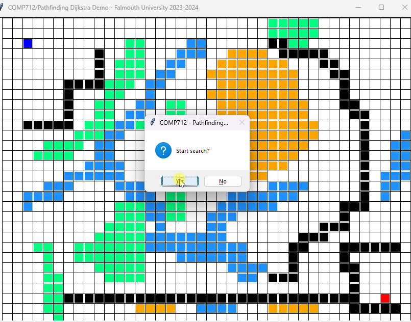

# COMP712: Classical Artificial Intelligence 

# Workshop: Pathfinding (2)

Dr Daniel Zhang @ Falmouth University\
2023-2024 Study Block 1



<div id="top"></div>

# Table of Contents
- [COMP712: Classical Artificial Intelligence](#comp712-classical-artificial-intelligence)
- [Workshop: Pathfinding (2)](#workshop-pathfinding-2)
- [Table of Contents](#table-of-contents)
- [Introduction](#introduction)
- [`Dijkstra's` Algorithm](#dijkstras-algorithm)
  - [The Pseudocode](#the-pseudocode)
- [`A*` Algorithm](#a-algorithm)
  - [The Pseudocode](#the-pseudocode-1)
- [The Repository](#the-repository)
  - [The Code Structure](#the-code-structure)
- [Your Task](#your-task)
  - [Task 1: run the demos](#task-1-run-the-demos)
  - [Task 2: implement `Dijkstra'a Algorithm`](#task-2-implement-dijkstraa-algorithm)
  - [Task 3: implement `A* Algorithm`](#task-3-implement-a-algorithm)
  - [Task 3: different number of neighbours](#task-3-different-number-of-neighbours)
- [Further Reading](#further-reading)

# Introduction
[Top](#top)

This is the second workshop on the topic of pathfinding. After implementing `BFS`, `DFS`, and `GBFS`, you will focus on `Dijkstra's` and `A*` Algorithms in this session, which are very useful for pathfinding in **weighted** graphs.

**Note**: While the first workshop outlines three main tasks and this one has two, you have the flexibility to manage the content across the two workshops at your own pace. If you haven't completed the initial three implementations, it's recommended to continue working on those tasks before proceeding with the exercises assigned for this session.

# `Dijkstra's` Algorithm
[Top](#top)

`Dijkstra's` Algorithm, named after computer scientist [Edsger W. Dijkstra](https://www.wikiwand.com/en/Edsger_W._Dijkstra), stands as one of the fundamental algorithms in graph theory and network analysis. Primarily used to find the shortest path in a ***weighted*** graph, it operates effectively on graphs where all the edge weights are non-negative. The algorithm commences by designating a source node and initially assigning tentative distances to all other nodes, with the source set at zero and the rest at infinity. It then systematically explores neighbouring nodes, continually updating the shortest known distances from the source as it traverses the graph. Through a process of relaxation, where it reassesses and refines the distances, `Dijkstra's` Algorithm gradually reveals the shortest path from the source to every other node in the graph.

Its methodology revolves around a priority queue or min-heap, selecting the node with the smallest tentative distance as it proceeds, ensuring an efficient exploration of nodes in order of their shortest potential distance from the source. Dijkstra's Algorithm is a notable and widely implemented tool in network routing protocols, transportation networks, and various applications requiring efficient pathfinding in weighted graphs. Its simplicity, optimality for non-negative edges, and ability to efficiently find the shortest path make it a cornerstone in various computational fields.

> `BFS` can be considered as a special case of `Dijkstra's` Algorithm on unweighted graphs.

## The Pseudocode
[Top](#top)

The `Dijkstra's` algorithm can be presented using the following pseudocode[<sup>1</sup>](https://www.wikiwand.com/en/Dijkstra's_algorithm#Pseudocode):

```vb
function Dijkstra(Graph, source):
    for each vertex v in Graph.Vertices:
        dist[v] ← INFINITY
        prev[v] ← UNDEFINED
        add v to Q
    dist[source] ← 0
    
    while Q is not empty:
        u ← vertex in Q with min dist[u]
        if u is the target
            break
        remove u from Q
        
        for each neighbour v of u still in Q:
            alt ← dist[u] + Graph.Edges(u, v)
            if alt < dist[v]:
                dist[v] ← alt
                prev[v] ← u

    return dist[], prev[]
```

The following version of pseudocode[<sup>2</sup>](https://www.wikiwand.com/en/Dijkstra's_algorithm#Using_a_priority_queue) makes use of the `PriorityQueue` data structure we saw in the last workshop.

```vb
function Dijkstra(Graph, source):
    dist[source] ← 0                           // Initialisation
    create vertex priority queue Q
	
    for each vertex v in Graph.Vertices:
        if v ≠ source
            dist[v] ← INFINITY                 // Unknown distance from source to v
            prev[v] ← UNDEFINED                // Predecessor of v
        Q.add_with_priority(v, dist[v])
		
    while Q is not empty:                      // The main loop
        u ← Q.extract_min()                    // Remove and return best vertex
        if u is the target:
            break
        for each neighbour v of u:              // Go through all v neighbours of u
            alt ← dist[u] + Graph.Edges(u, v)
            if alt < dist[v]:
                dist[v] ← alt
                prev[v] ← u
                Q.decrease_priority(v, alt)
    return dist[], prev[]
```

# `A*` Algorithm
[Top](#top)

The `A*` algorithm, renowned for its heuristic-based approach to pathfinding, stands as a pivotal algorithm in computer science, particularly in traversing ***weighted*** graphs and searching for the shortest path. Building on the foundation of `Dijkstra's` Algorithm, `A*` integrates a heuristic function that guides its exploration, enabling more informed decisions about which paths to explore. This heuristic estimates the distance from the current node to the target node, influencing the algorithm to prioritize paths that appear to be closer to the goal. `A*` uses a blend of two types of costs for each node: the `actual cost` from the start node to the current node (known as the '`g`' value) and the `estimated cost` from the current node to the target (the '`h`' value).

`A*` balances between the '`g`' and '`h`' values, aiming to minimise the total estimated cost ('`f`' value) for reaching the destination node. It traverses the graph by expanding the nodes with the lowest '`f`' values, effectively combining the benefits of both `Dijkstra's` Algorithm and `greedy best-first` search. This integration of a heuristic function ensures efficiency by favouring paths that appear to be more promising, significantly reducing the number of nodes explored compared to uninformed search algorithms. The `A*` algorithm's adaptability to various domains, its optimality under certain conditions, and its balance between completeness and efficiency have made it a cornerstone in various applications, such as route planning, game AI, and robotics.

> The `A*` algorithm is a generalisation of `Dijkstra's` algorithm that cuts down on the size of the subgraph that must be explored, if additional information is available that provides a lower bound on the "distance" to the target.

## The Pseudocode
[Top](#top)


```c++
function reconstruct_path(cameFrom, current)
    total_path := {current}
    while current in cameFrom.Keys:
        current := cameFrom[current]
        total_path.prepend(current)
    return total_path

// A* finds a path from start to goal.
// h is the heuristic function. h(n) estimates the cost to reach goal from node n.
function A_Star(start, goal, h)
    // The set of discovered nodes that may need to be (re-)expanded.
    // Initially, only the start node is known.
    // This is usually implemented as a min-heap or priority queue rather than a hash-set.
    openSet := {start}

    // For node n, cameFrom[n] is the node immediately preceding it on the cheapest path from the start
    // to n currently known.
    cameFrom := an empty map

    // For node n, gScore[n] is the cost of the cheapest path from start to n currently known.
    gScore := map with default value of Infinity
    gScore[start] := 0

    // For node n, fScore[n] := gScore[n] + h(n). fScore[n] represents our current best guess as to
    // how cheap a path could be from start to finish if it goes through n.
    fScore := map with default value of Infinity
    fScore[start] := h(start)

    while openSet is not empty
        // This operation can occur in O(Log(N)) time if openSet is a min-heap or a priority queue
        current := the node in openSet having the lowest fScore[] value
        if current = goal
            return reconstruct_path(cameFrom, current)

        openSet.Remove(current)
        for each neighbor of current
            // d(current,neighbor) is the weight of the edge from current to neighbor
            // tentative_gScore is the distance from start to the neighbor through current
            tentative_gScore := gScore[current] + d(current, neighbor)
            if tentative_gScore < gScore[neighbor]
                // This path to neighbor is better than any previous one. Record it!
                cameFrom[neighbor] := current
                gScore[neighbor] := tentative_gScore
                fScore[neighbor] := tentative_gScore + h(neighbor)
                if neighbor not in openSet
                    openSet.add(neighbor)

    // Open set is empty but goal was never reached
    return failure
```

# The Repository
[Top](#top)

This repository contains the materials for COMP712 - Pathfinding (1) workshop.

> **[https://github.falmouth.ac.uk/Daniel-Zhang/COMP712-Pathfinding-2.git](https://github.falmouth.ac.uk/Daniel-Zhang/COMP712-Pathfinding-2.git)**

There are three demos available:

- `demo_dijkstra.pyc`: Demonstrates Breadth-first search
- `demo_a_star.pyc`: Demonstrates Depth-first search
- 3 pre-defined maps are provided, which can be loaded by key <kbd>`L`</kbd>

## The Code Structure
[Top](#top)

In this workshop, the existing `gui_lib` remains a fundamental tool for your tasks, and the core structures of the code remain consistent with previous sessions. You're encouraged to refer back to the materials provided in the prior workshop for guidance.

However, the new challenge lies in utilising additional features within the `gui_lib` to mark specific cells like `GRASS`, `DESERT`, or `WATER`, as their traversal will incur different costs. 

- Moving from an `EMPTY` cell to an adjacent `EMPTY` cell, the default cost remains **`1`**.
- Moving to `GRASS` carry a cost of **`5`**, `DESERT` costs **`10`**, and `WATER` incurs a cost of **`15`**.

>Your task is to implement a solution capable of determining the shortest path considering these varied costs.


# Your Task
[Top](#top)

## Task 1: run the demos
[Top](#top)

Run the demos to see how each of the algorithms work differently. You can either load the provided maps or create map by yourself. 

   - left-click to mark a block
   - right-click once to mark the start cell if no start defined
   - right-click again to mark the end cell if no end defined
   - right-click on any marked cell (start, end, or block) to reset the cell 
   - Create your own map by pressing <kbd>CTRL</kbd>, <kbd>SHIFT</kbd>, and <kbd>ALT</kbd> to mark special cells of `GRASS`, `DESERT`, and `WATER`.
     - Press <kbd>C</kbd> at the same time for block operation (9 cells at the same time).
   - The default `A*` uses the Euclidean Distance as the heuristic function. You can switch to Manhattan Distance by pressing <kbd>E</kbd>.
   - Other keyboard shortcuts are available - show help using <kbd>H</kbd>.


## Task 2: implement `Dijkstra'a Algorithm`
[Top](#top)

- Complete the implementation of `Dijkstra'a Algorithm` algorithm in `dijkstra.py`. You only need to make sure the `self.path` list has bee filled by `Cell` objects from the start to the end. 
- Create new maps and try to run your code.

> **RECALL**: 
> - The `self.search()` function is mandatory.
> - It should return `True` or `False` to indicate if a path can be found from `self.start` to `self.end`.
> - Make sure you fill up the `self.path` list with cells on the found path.
> - To enable animation, make use of the following code snippets in your `search()` function.
> ```python
> # other code blocks ...
> if self.animate:
>     self.animateCell(c)
>     self.update()
> # other code blocks ...
> ```

## Task 3: implement `A* Algorithm`
[Top](#top)

- Complete the implementation of `A* Algorithm` algorithm in `a_star.py`. You only need to make sure the `self.path` list has bee filled by `Cell` objects from the start to the end. 
- Create new maps and try to run your code.
- The heuristic function used is the Euclidean Distance, the same one as the last session. You can define your own function if you like.

## Task 3: different number of neighbours
[Top](#top)

The default implementation focuses on exploring 4 neighbors around a given cell: north, south, east, and west. However, in certain games, characters are capable of moving in 8 different directions rather than just 4, as described in last workshop session.

- Consider modifying your code to implement an 8-neighbourhood search and subsequently compare the outcomes with the 4-neighbourhood version.

**Note:**

You can submit a pull request to the original repository to showcase your work if you like.

# Further Reading
[Top](#top)

1. [Dijkstra's Algorithm for Shortest Paths](https://math.libretexts.org/Bookshelves/Combinatorics_and_Discrete_Mathematics/Applied_Combinatorics_(Keller_and_Trotter)/12%3A_Graph_Algorithms/12.03%3A_Dijkstra's_Algorithm_for_Shortest_Paths)
2. [A* Search](https://www.codecademy.com/resources/docs/ai/search-algorithms/a-star-search)
3. [Introduction to the A* Algorithm](https://www.redblobgames.com/pathfinding/a-star/introduction.html)

