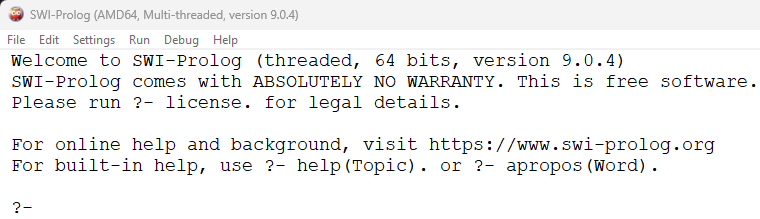
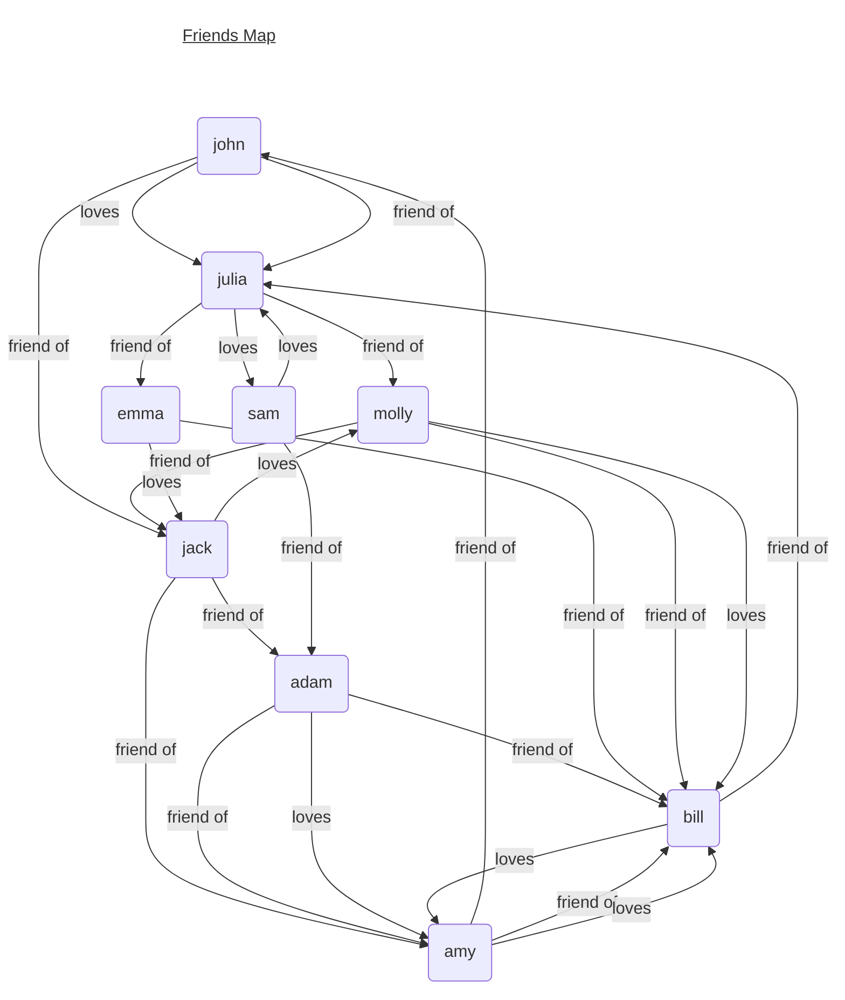
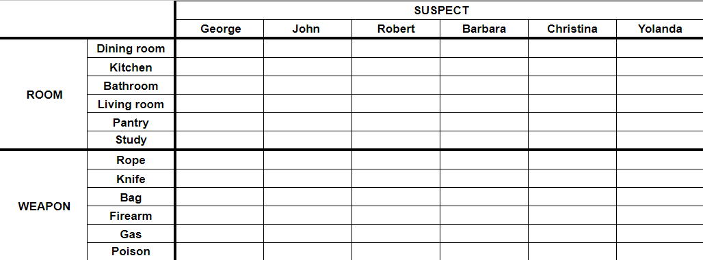

# COMP712: Classical Artificial Intelligence 

# Workshop: Logic Programming With PROLOG

Dr Daniel Zhang @ Falmouth University\
2023-2024 Study Block 1


- [COMP712: Classical Artificial Intelligence](#comp712-classical-artificial-intelligence)
- [Workshop: Logic Programming With PROLOG](#workshop-logic-programming-with-prolog)
- [Introduction](#introduction)
- [Applications](#applications)
- [Prolog Fundamentals](#prolog-fundamentals)
- [Install SWI-Prolog](#install-swi-prolog)
- [Try SWI-Prolog](#try-swi-prolog)
- [Task 1: Reveal the Friends Map](#task-1-reveal-the-friends-map)
  - [Q1: work out the table of friends for each person](#q1-work-out-the-table-of-friends-for-each-person)
  - [Q2: answer the following questions](#q2-answer-the-following-questions)
- [Task 2: Expert System about the Royal Family](#task-2-expert-system-about-the-royal-family)
- [Task 3: Chicken and Rabbits Problem](#task-3-chicken-and-rabbits-problem)
- [Task 4: Map Colouring Problem](#task-4-map-colouring-problem)
- [Task 5: Who is the murder?\*](#task-5-who-is-the-murder)
- [Notes](#notes)


# Introduction

[Top](#top)

Prolog, abbreviated for "*Programming in Logic*", stands as a pioneering language in the realm of declarative programming. Unlike imperative languages that focus on how to achieve a result, Prolog follows a different paradigm, emphasising what outcomes are desired. It operates on a foundation rooted in symbolic logic and rule-based reasoning, making it uniquely suited for problems in artificial intelligence, natural language processing, expert systems, and symbolic computation.

At its core, Prolog operates on the concept of logical inference through a set of rules and facts. These rules and facts form a knowledge base representing relationships, conditions, and logical implications. The language revolves around predicates, which define relationships between entities, and queries, which are posed to the knowledge base to derive solutions. Prolog excels in employing unification, a process that matches variables in queries with facts or rules in the knowledge base, allowing for logical deductions and backtracking to find solutions.

Prolog's elegant simplicity lies in its ability to express complex problem-solving tasks concisely. It employs a logical and intuitive approach, using a compact syntax that allows programmers to focus more on defining the problem's structure rather than explicit procedural instructions. As a result, Prolog serves as a powerful tool for both educational purposes to understand logic-based programming and real-world applications where rule-based reasoning is crucial.

# Applications
[Top](#top)

Prolog, with its logic-based programming paradigm, finds applications in various domains due to its ability to model and solve problems based on rules and relationships. Here are some applications of Prolog:

1. **Natural Language Processing (NLP):** Prolog's natural fit for symbolic reasoning makes it valuable in parsing and processing natural languages. It's used in language understanding, grammar parsing, and building chatbots.

2. **Expert Systems:** Prolog's rule-based approach is ideal for building expert systems that mimic human expertise in specific domains. It's applied in medical diagnosis, decision support systems, and troubleshooting.

3. **Symbolic Computation:** Prolog's ability to handle symbolic expressions makes it suitable for symbolic mathematics, theorem proving, and symbolic integration.

4. **Artificial Intelligence (AI):** Prolog is used in various AI applications due to its ability to represent and reason with knowledge effectively. This includes rule-based AI, knowledge-based systems, and problem-solving tasks.

5. **Database Querying:** Prolog's logic-based nature is useful for querying databases and reasoning about relational data. It's applied in database languages and expert databases.

6. **Semantic Web:** Prolog is used in semantic web technologies to reason about ontologies, relationships, and the semantic meaning of data.

7. **Robotics and Automation:** Prolog can be used for robot control, planning, and scheduling in robotics applications, where logical reasoning is essential.

8. **Education and Research:** Prolog is a popular language for teaching logic-based programming concepts due to its simple syntax and powerful logical inference capabilities.

These applications showcase the versatility of Prolog in domains where rule-based reasoning, logical inference, and symbolic manipulation play significant roles. Its expressiveness and ability to represent real-world problems in a natural and intuitive way make it a valuable tool across diverse fields.

# Prolog Fundamentals
[Top](#top)

A Prolog program consists of several fundamental components:

`Facts`: These are statements that establish relationships or attributes. Facts in Prolog are represented as predicates without any conditions. For instance:

```prolog
animal(cat).
color(apple, red).
likes(john, pizza).
```

`Rules`: Rules define logical relationships or conditions between different facts or predicates. They consist of a head and a body separated by the :- symbol. The head represents the conclusion, and the body contains the conditions for that conclusion. For example:

```prolog
mortal(X) :- human(X).
sibling(X, Y) :- parent(Z, X), parent(Z, Y), X \= Y.
```

`Queries`: These are user-defined queries posed to the Prolog interpreter, seeking information or solutions based on the defined facts and rules. Queries are formed by stating a predicate and variables or constants to find solutions or verify relationships. For instance:

```prolog
?- likes(john, pizza).
```

`Variables`: These are symbolic placeholders that can be unified with values. They begin with an uppercase letter or an underscore. Variables are used in queries to retrieve specific values or bindings from the knowledge base.

`Clauses`: Clauses are either facts or rules. They form the basis of Prolog programs and represent the knowledge base from which the Prolog engine derives solutions by matching and unifying queries with the defined clauses.

These components collectively form a Prolog program, where facts and rules define relationships and conditions, and queries are used to retrieve information or find solutions based on the defined logic within the program.

# Install SWI-Prolog
[Top](#top)

To download SWI-Prolog for your workshop, follow these steps: 

- First, navigate to the SWI-Prolog website (https://www.swi-prolog.org/). Choose the appropriate version based on your operating system (Windows, macOS, Linux, etc.) and select the installer that suits your system specifications. 
- Once the download completes, run the installer and follow the installation prompts. 
- During installation, you might be asked to specify certain settings; the default settings usually work well for most cases. 
- Once installed, you can launch SWI-Prolog from your applications or programs folder. 

Explore the provided documentation and tutorials available on the SWI-Prolog website to get familiar with the environment.

> If you have difficulties of installing SWI-Prolog, there is an [online version](https://swish.swi-prolog.org/).

# Try SWI-Prolog
[Top](#top)

Upon launching SWI-Prolog, you'll find the Prolog interpreter or console. Here, you can input Prolog code and execute queries. Get familiar with the console, where you'll receive feedback for queries and see Prolog's responses.



> NOTE: SWI-Prolog's console is for *queries* execution, which is slightly different from the other programming languages (like Python's IDLE).

You can start typing some basic queries here. 

```prolog
?- write('Hello World!').
Hello World!
true.

?- write('Hello '), nl, write('world!').
Hello 
world!
true.

?- X is 4*10 + 2.
X = 42.

?- 
```

- `write`: is called a functor and represented as `write/1` means it takes 1 argument. (same concept in erlang or elixir to add the number of arguments to the function name)
- `nl`: used to print newline
- to execute sequence of commands you use `,` which is the `AND` operator also if it fails the whole computation fails (similarly, `;` can be used to represent `OR`, and `\+` can represent `NOT`)
- `is`: assignment operator followed by math expression
- variables are ***Capitalised*** `X` not **`x`**

You will need to write your own '`.pl`' files to save predicates such as facts and rules. It can then be loaded in SWI-Prolog via `[filename]` command. As long as the file was loaded successfully, you can start making queries with it.

> NOTE: 
> - get current working directory: you can use **`pwd.`** to check the current working folder.
> - change working directory: **`working_directory(CWD,'NewPath').`** should be used to change the working directory. **`CWD`** must be **UPPERCASE**.

# Task 1: Reveal the Friends Map
[Top](#top)

Read the friends map below, write a new `.pl` prolog file to define these relationships as facts and rules to finish the tasks. Facts and rules you might need to start with include `friend().` and `loves().`.


* _No one loves more than 1 person._

## Q1: work out the table of friends for each person
[Top](#top)

Load your prolog file in SWI-Prolog and find out the relationships for each person using queries. Fill '`None`' if the requested item is an empty list.

| **Name** 	| **Friends** 	| **Loves** 	|
|----------	|-------------	|-----------	|
| John     	|             	|           	|
| Julia    	|             	|           	|
| Emma     	|             	|           	|
| ...      	|             	|           	|

## Q2: answer the following questions
[Top](#top)

Add a new rule called '`knows`', we will defined '`knows`' as a relationship between 2 person if one is the friend of the other. Update your prolog file and run queries.

1. Who knows Adam?
2. Who knows Molly?

Let's define another rule called '`lovers`', each pair of lovers are 2 people who love each other. Update your prolog file and run queries to find out the answers to the following questions.

3. How many pairs of lovers can you spot? And who are they?

# Task 2: Expert System about the Royal Family
[Top](#top)

In this task, you will build up a 'simplified' version of the British Royal Family tree to run some queries.


Reference: https://ichef.bbci.co.uk/news/976/cpsprodpb/164E1/production/_130316319_royal_family_tree_976-nc.png.webp*

Create a new `.pl` file to record the facts and rules. Some rules you might want to define include:

- Facts and Rules:
  - female().
  - male(). 
  - mother().
  - father().
  - parents().
  - son().
  - daughter().
  - child().
  - grandfather().
  - grandmother().
  - grandparents().
  - grandson().
  - granddaughter().
  - grandchild().
  - wife().
  - husband().
  - married().
  - sibling().
  - nephew().
  - cousin().
  - ...

**Run some queries after you finish the definitions of the facts and rules.**

# Task 3: Chicken and Rabbits Problem
[Top](#top)

This is a widely-known logic problem that Chinese children often encounter during their primary school years, which was firstly introduced in `'Master Sun's Mathematical Manual'` (a mathematical treatise written during 3rd to 5th centuries CE). 

The scenario involves a barn where both chickens and rabbits are kept. With the information given about the total number of legs and heads present, the challenge is to determine the specific quantities of chickens and rabbits.

**Q: 150 heads and 396 legs. How many chickens and how many rabbits respectively?**

> Hint: the module `clpq` can be introduced to enable simple operations as shown below.

```prolog
:- use_module(library(clpq)).

sum10(X,Y) :- {X+Y=10}.
```

# Task 4: Map Colouring Problem
[Top](#top)

Given a map, we'd like to find if it can be coloured using 3 colours: `red`, `blue`, and `green` so that no two adjacent regions have the same color.


Reference: https://coloringnation.com/coloring/p6i/yME/p6iyMEpcn.gif

**Q: Your task is to find a proper colour definitions for each state showing in the partial map.**

# Task 5: Who is the murder?*
[Top](#top)

You were at a murder scene with Detective Holmes. There are 6 suspects: 3 men (George, John, Robert) and 3 women (Barbara, Christine, Yolanda). You were given some clues about the case and your task is to find out who is the murderer. 

- Clue 1: 
  Each person was in a different room (Bathroom, Dining Room, Kitchen, Living Room, Pantry, Study). 
- Clue 2: 
  A suspected weapon was found in each room (Bag, Firearm, Gas, Knife, Poison, Rope).
- Clue 3:
  The man in the kitchen was not found with the rope, knife, or bag. Which weapon, then, which was not the firearm, was found in the kitchen?
- Clue 4:
  Barbara was either in the study or the bathroom; Yolanda was in the other. Which room was Barbara found in?
- Clue 5: 
  The person with the bag, who was not barbara nor George, was not in the bathroom nor the dining room. Who had the bag in the room with them?
- Clue 6: 
  The woman with the rope was found in the study.Who had the rope?
- Clue 7:
  The weapon in the living room was found with either John or George. What weapon was in the living room?
- Clue 8:
  The knife was not in the dining room.So where was the knife?
- Clue 9:
  Yolanda was not with the weapon found in the study nor the pantry. What weapon was found with Yolanda?
- Clue 10:
  The firearm was in the room with George. In which room was the firearm found?
- Clue 11:
  It was discovered that Mr. Boddy was gassed in the pantry. The suspect found in that room was the murderer. Who, then, do you point the finger towards?

Q1: Find out who is the murderer! 

Q2: Fill in the table if you can:



# Notes
[Top](#top)

1. There's no repository for this workshop. 
2. Check [SWI-Prolog website](https://www.swi-prolog.org/) for more information.
3. Do you know that the Sudoku problem can be solved by Prolog as well, as shown in [this article](https://www.metalevel.at/sudoku/).