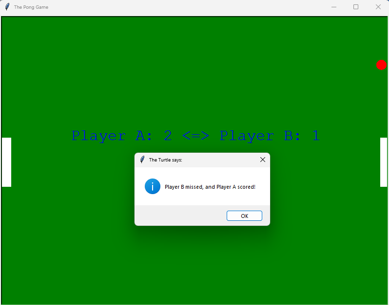
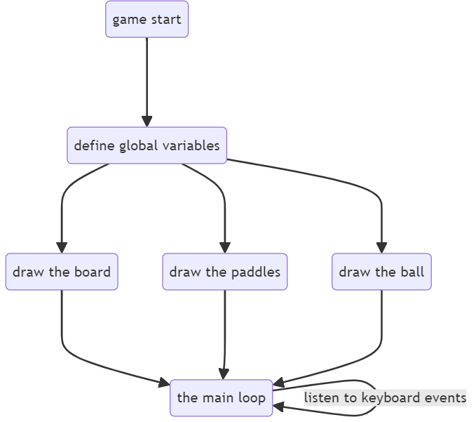
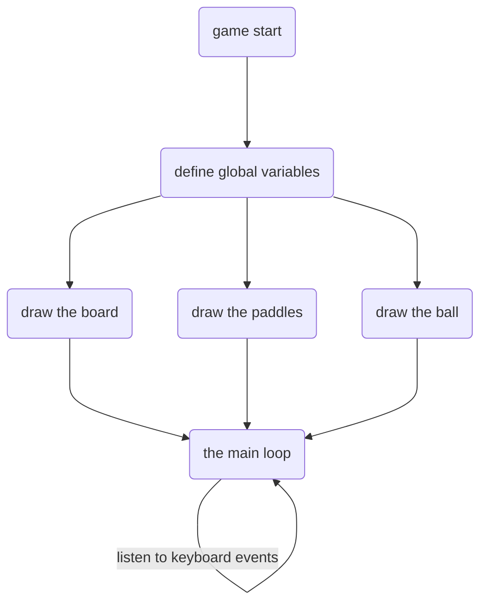
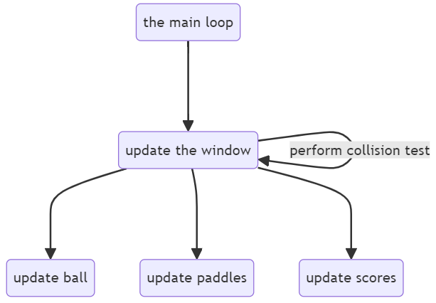
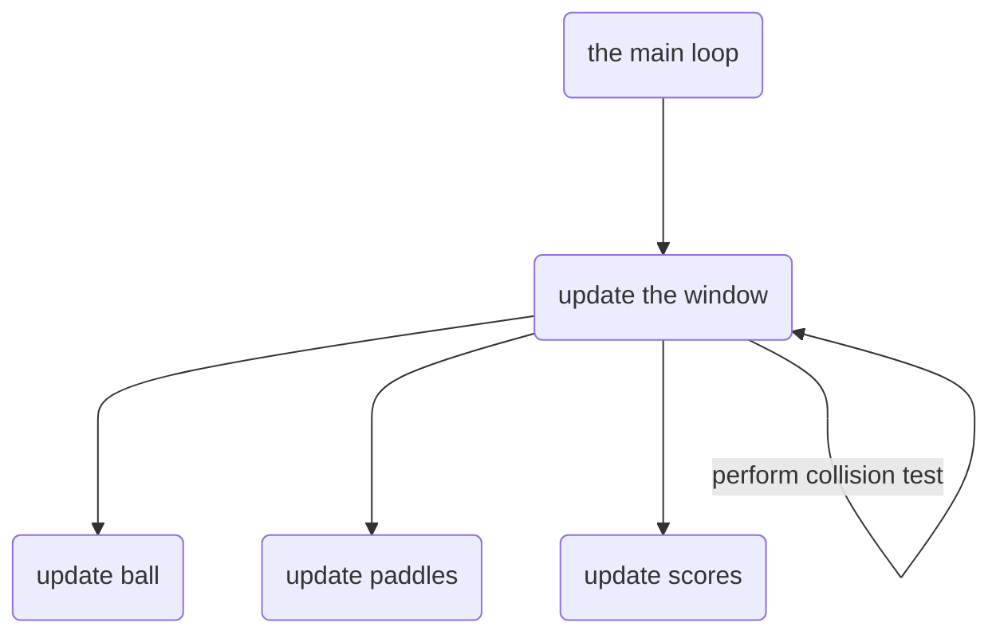

# COMP712: Classical Artificial Intelligence 

# Workshop: Pong Game Implementation

Dr Daniel Zhang @ Falmouth University\
2023-2024 Study Block 1



<div id="top"></div>

# Table of Contents
- [COMP712: Classical Artificial Intelligence](#comp712-classical-artificial-intelligence)
- [Workshop: Pong Game Implementation](#workshop-pong-game-implementation)
- [Table of Contents](#table-of-contents)
- [Workshop: Pong Game Implementation](#workshop-pong-game-implementation-1)
- [The Repository](#the-repository)
- [Game Play](#game-play)
- [Game Controls](#game-controls)
- [The Code](#the-code)
- [The Functions](#the-functions)
- [Your Task](#your-task)


# Workshop: Pong Game Implementation
<a href="#top">Top</a>

During this workshop, you will put your Python skills to the test by completing the implementation of the Pong game.

# The Repository
<a href="#top">Top</a>

The repository linked below contains the code for a basic 2-player PONG game.

**Fork the repository** (do not clone!) and work on your fork. This will enable you to submit a pull request at the end.

> [**https://github.falmouth.ac.uk/Daniel-Zhang/COMP712-Python-Pong.git**](https://github.falmouth.ac.uk/Daniel-Zhang/COMP712-Python-Pong.git)

# Game Play
<a href="#top">Top</a>

Ensure that you have successfully downloaded `demo.pyc`. Then, open a command window in the folder and run the game by executing:

```bash
python demo.pyc
```

If everything is working correctly, you should see a GUI similar to the screenshot above.

**Note**:

The `.pyc` file was compiled using `Python 3.12.0` and should work with any `Python 3.x` versions. However, if you encounter any issues while running the script, please let me know, and a newer version of the script can be uploaded to the repository.

# Game Controls
<a href="#top">Top</a>

This is a 2-player game. Player A can control the left paddle using <kbd>W</kbd> and <kbd>S</kbd> for up and down, while Player B uses <kbd>↑</kbd> and <kbd>↓</kbd>.

# The Code
<a href="#top">Top</a>

The implementation is relatively straightforward. Let's take a closer look at the detailed structure of the code:

<!--  -->



The main loop can be illustrated as:

<!--  -->



# The Functions
<a href="#top">Top</a>

There are four functions defined for keyboard controls:

1. `left_paddle_up()`: Move the left paddle upwards with <kbd>W</kbd>.
2. `left_paddle_down()`: Move the left paddle downwards with <kbd>S</kbd>.
3. `right_paddle_up()`: Move the right paddle upwards with <kbd>↑</kbd>.
4. `right_paddle_down()`: Move the right paddle downwards with <kbd>↓</kbd>.

Additionally, there are two functions for displaying messages and drawing text on the board:

1. `msgbox(msg)`: Display a modal dialogue box with the given msg string.
2. `write_text(txt)`: Display the provided txt string on the board.

**Note:**

- The last two functions are primarily for debugging purposes and do not affect gameplay. They are useful for checking collision with window borders and paddles.

- You may need to improve the control functions to prevent paddles from moving out of the window in some cases.

# Your Task
<a href="#top">Top</a>

1. Implement collisions with the board's top and bottom, as well as the left and right paddles to make the game complete.

2. Change the ball's starting speed using the random module.

3. Adjust the size and moving speed of the paddles.

4. Add more fun by speeding up the ball after a certain number of catches.

5. Increase the excitement by adding a 'random' direction change for each collision with the board or paddle.

6. Implement any other improvements you can imagine!

**Note:**

You can submit a pull request to the original repository to showcase your work if you like.