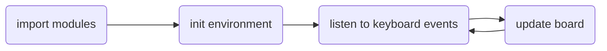

# COMP712: Classical Artificial Intelligence 
#  Workshop: Rule-based AI (PAC-MAN Example)

Dr Daniel Zhang @ Falmouth University\
2023-2024 Study Block 1


<div id="top"></div>

# Table of Contents
- [COMP712: Classical Artificial Intelligence](#comp712-classical-artificial-intelligence)
- [Workshop: Rule-based AI (PAC-MAN Example)](#workshop-rule-based-ai-pac-man-example)
- [Table of Contents](#table-of-contents)
  - [PAC-MAN: The Game](#pac-man-the-game)
  - [Before We Start: The Setup](#before-we-start-the-setup)
    - [Python Installation](#python-installation)
    - [FreeGames Module](#freegames-module)
  - [The Repository](#the-repository)
  - [Give It a Try](#give-it-a-try)
    - [**Task 1**:](#task-1)
  - [The Code Structure](#the-code-structure)
  - [The Functions](#the-functions)
    - [**Task 2**:](#task-2)
  - [Ghost Behaviour: The Rules](#ghost-behaviour-the-rules)
    - [**Task 3**:](#task-3)
    - [**Task 4**:](#task-4)
    - [**Task 5\***](#task-5)
  - [Submit Your Code](#submit-your-code)

## PAC-MAN: The Game
<a href="#top">Top</a>

[PAC-MAN](https://pacman.cc/) is one of the most popular games (maybe?) although the ghost AI is fairly simple. It is a very example for experimenting with the idea of rule-based AI. 

For a better understanding of rule-based AI in games, you are going to have some exercises using a simple PAC-MAN game implemented in Python.

## Before We Start: The Setup
<a href="#top">Top</a>

### Python Installation
<a href="#top">Top</a>

You will need to coding in [`python`](https://www.python.org/). Please install the latest version by visiting the link if you haven't done so. The might be other libraries we need along the road. But it should be fine to just install Python by now. Refer to [The first workshop](../python/python_lab.html) if you don't have python installed.

You can use some management tools like `conda`, `virtualenv` or `pipx` if you like. But `pip` would be sufficient for you to carry out the experiment of this workshop.

### FreeGames Module
<a href="#top">Top</a>

[FreeGames](https://www.geeksforgeeks.org/freegames-module-in-python/) module includes some basic but fun games, such as Snake, Life, Maze, Flappy, and Pac-Man. Please follow the instructions bellow to install it. active

- Install FreeGames using `pip`
  
    >  ```python
    >  C:\>python -m pip install freegames
    >  ```

- Check all the free games provided by this module. 

    >    ```python
    >    C:\>python -m freegames list
    >    ...
    >    pacman
    >    ...
    >    C:\>
    >    ```

- As long as you can see `pacman` in the list, you are ready to go.

## The Repository
<a href="#top">Top</a>

The repository below contains the template code of a basic PAC-MAN game.

**Fork the repository** (NOT clone!) and work on your fork. This will enable you to submit a pull request in the end.

[**https://github.falmouth.ac.uk/Daniel-Zhang/COMP712-Rule-based-AI.git**](https://github.falmouth.ac.uk/Daniel-Zhang/COMP712-Rule-based-AI.git)

The `.py` file can be opened by any text editor. However, a proper programming style editor or IDE would be helpful, such as `IDLE`, `VS Code`, `PyCharm`, `Spyder`, `NotePad++`, or any other you prefer. `VS Code` might be a good start!

## Give It a Try
<a href="#top">Top</a>

The repository contains a compiled working game prototype `pacman.pyc`. By moving PAC-MAN using the four arrow keys (&larr;, &uarr;, &rarr;, &darr;), the game will start, and the ghosts will move simultaneously. Control the PAC-MAN and try to score as much as you can before the ghosts catch you!

---

### **Task 1**: 

- **Start the game** using `python pacman.py` and give it a try!
---

## The Code Structure
<a href="#top">Top</a>

Open the code in your selected editor and have a look about the code structure.  

After `import` the required modules and define necessary variables to represent the PAC-MAN, the ghosts, and the board, there are several function definitions before actually running the game loop at the end of the source file.  



## The Functions
<a href="#top">Top</a>

A brief explanation of how the code works:

- The code starts by importing necessary modules, including the `choice` function from the `random` module and the `Turtle` class from the `turtle` module.
- It defines a dictionary named `state` to keep track of the game score and initializes it with a score of `0`.
- The game area is represented by a grid of `tiles`. The `tiles` list stores the configuration of the grid, where `0` represents walls, `1` represents pellets, and `2` represents eaten pellets.
- Several helper functions are defined:
  1. `draw_grid(x, y)`: Draws a grid (one tile) at the given coordinates `(x, y)` using the `Turtle` graphics.
  2. `draw_dot(p, c, s, pen)`: Draws a dot (circle) at position `p(x,y)` with colour `c` (str) and size `s`. It has been used to draw Pacman, Ghost, and pellets, for drawing the pellets, a specific pen has to be defined.
  3. `random_direction()`: Randomly choose one vector from the list of 4 directions as the next movement of ghost.
  4. `get_index(point)`: Converts a point in the game world to an index in the `tiles` list.
  5. `is_valid(point)`: Checks if a given point is a valid position in the game world, considering walls and boundaries.
  6. `draw_board()`: Draws the game world by iterating through the `tiles` list and calling `grid()` to draw each tile.
  7. The main game loop is defined in the `play()` function. It updates the game state, moves the pacman and ghosts, checks for collisions, and updates the display. The loop is implemented using recursive calls to `play()` function with a delay of `100` milliseconds.
  8. The `change(x, y)` function is used as event handlers for the arrow keys. It updates the aim of the pacman based on the arrow key pressed, if the new position is valid.
  9. The code under the line `if __name__ == '__main__':` sets up the game window and graphics, sets up event listeners for key presses, and then initializes the game by calling `init()` and `keyboard()`. Then, the `draw_board()` and `play()` were called to start the game. The `done()` function from the `turtle` module is used to start the game loop and keep the window open.

---

### **Task 2**: 

- Play with the code to have a feel of how the function are combined together. 
  - Search [Python](https://docs.python.org/3/) or [`Turtle`](https://docs.python.org/3/library/turtle.html) documentation if you are not familiar with some functions.
- Change the starting position of the PAC-MAN.
- Change the number of ghosts and their positions

---

## Ghost Behaviour: The Rules
<a href="#top">Top</a>

As described in the lectures, the ghost are implemented as rule-based agents with limited AI. However, it's amazing to see that a combination of simple rules can result such an complex game environment. Check [Ghost Behaviour](http://gameinternals.com/understanding-pac-man-ghost-behavior) for better understanding. 

---

Recall:

- **Red ghost**: aim for Pac-Man
- **Pink ghost**: aim for 2 spaces ahead of Pac-Man
- **Blue ghost**: aim for position on the line between red ghost and 2 aces ahead of Pac-Man
- **Orange ghost**: aim for Pac-Man until 8 spaces away, then aim for corner

---

Currently, the ghosts have the same colours so that they are moving in the same way (or in other words 'following the same rule'). Think about the question of 'how can you introduce more rules to the ghosts?'.

One can split the task into several steps. Feel free to refactor the code by the use of `class` and/or global variables if necessary.

---

### **Task 3**:
<a href="#top">Top</a>

- Assign different colours to the ghosts.
- Make ghosts with different colours move at different speeds.

---

### **Task 4**:
<a href="#top">Top</a>

- Assign new rules to ghosts depending on their colours (might be tricky, take your time and keep on working).

---

### **Task 5\***
<a href="#top">Top</a>

- **Modify the game board** that is represented by the `tiles` matrix (actually it is a `list` data type in Python). 
- Note: 
  1. Do make changes gradually by flipping one value at a time and re-running the game to see the effect. 
  2. Make sure the board is still valid if you tried to change the size of the matrix - in this case you might need to change the tile index calculation as well.

---

## Submit Your Code
<a href="#top">Top</a>

You can submit a pull request to the original repository to showcase your work if you like.