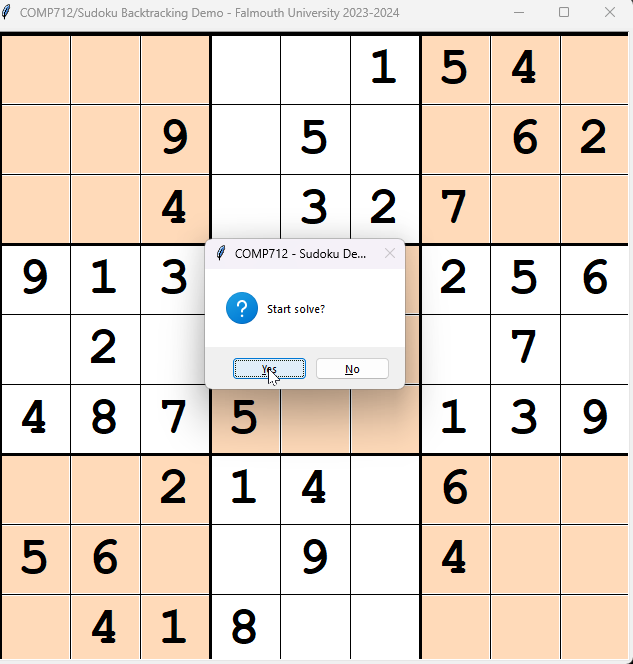

# COMP712: Classical Artificial Intelligence 

# Workshop: Constraint Satisfaction Problem (CSP)

Dr Daniel Zhang @ Falmouth University\
2023-2024 Study Block 1

# Table of Contents
- [COMP712: Classical Artificial Intelligence](#comp712-classical-artificial-intelligence)
- [Workshop: Constraint Satisfaction Problem (CSP)](#workshop-constraint-satisfaction-problem-csp)
- [Table of Contents](#table-of-contents)
- [Introduction](#introduction)
  - [CSP](#csp)
  - [The Game](#the-game)
- [The Repository](#the-repository)
  - [Code Structure](#code-structure)
- [Your Task](#your-task)
  - [Task 1: implement `backtracking` algorithm (BT)](#task-1-implement-backtracking-algorithm-bt)
  - [Task 2: implement `constraint propagation` (CP)](#task-2-implement-constraint-propagation-cp)
  - [Task 3: combine `BT` and `CP`](#task-3-combine-bt-and-cp)
- [Further Reading](#further-reading)

# Introduction
[Top](#top)

We've learnt Constraint Satisfaction Problem (CSP) during the lecture. Now, you know that there are two popular ways of solving the CSP: the Backtracking algorithm (BT) and Constraint Propagation (CP). In this workshop, you will implement these two methods to solve [Sudoku](https://sudoku.com/) puzzles.

## CSP
[Top](#top)

CSP is a powerful framework used in artificial intelligence and computer science to represent and solve problems where a set of variables must satisfy certain constraints. At its core, a CSP involves a collection of variables, each with a domain of possible values, and a set of constraints that limit the permissible combinations of values for these variables. The primary goal in a CSP is to find a solution that satisfies all the constraints simultaneously, adhering to the specified criteria without violating any constraints. The challenge in CSPs lies in efficiently exploring the solution space to identify valid assignments that meet all constraints, often employing algorithms like `backtracking` or `constraint propagation` to navigate the possibilities and arrive at a satisfactory solution.

## The Game
[Top](#top)

The [Sudoku](https://sudoku.com/) puzzle is a popular and captivating example of a CSP. It consists of a 9x9 grid divided into nine 3x3 subgrids. The objective is to fill each cell in the grid with a digit from 1 to 9, ensuring that each row, column, and subgrid contains all digits exactly once. The clues provided at the beginning create constraints, restricting the potential values that can be placed in specific cells, thereby turning the puzzle into a classic CSP.

This puzzle perfectly encapsulates the fundamental components of a CSP: `variables` (the cells), `domains` (allowable digits), and `constraints` (the rules governing placement). Solving Sudoku involves deducing the valid assignment of digits that meets all constraints, typically leveraging CSP-solving techniques like `backtracking` or `constraint propagation`. The interplay of logical deduction and constraint satisfaction in Sudoku showcases the application of CSPs in solving complex, structured problems across various domains, offering a tangible and enjoyable demonstration of this computational concept.

# The Repository
[Top](#top)

This repository contains the materials for COMP712 - CSP workshop.

https://github.falmouth.ac.uk/Daniel-Zhang/COMP712-CSP.git

There are 2 demos available. For demonstration purpose the GUI was refreshed more frequently than usual:

- `demo_sudoku_bt.pyc`: demo of solving Sudoku using Backtracking algorithm (BT)
- `demo_sudoku_cp.pyc`: demo of solving Sudoku using Constraint Propagation (CP)
- several predefined puzzles
- Press <kbd>H</kbd> for help

## Code Structure
[Top](#top)

- `bt_sudoku.py`: the template for the backtracking algorithm that you are going to implement.
- `cp_sudoku.py`: the template for constraint propagation that you are going to implement.

The `gui_lib` contains helper functions for visualisation. Some of them are:

- `fillCell(v: Cell, s: int, force_update=False)`: fills a specific cell `v` using the number `s`, update the board if `force_update` is `True`
- `clearCell(v: Cell, force_update=False)`: clears a cell `v` and update the board if `force_update` is `True`
- `animateCell(c: Cell, colour='white')`: changes the specified cell **`c`**'s background colour with `colour`, then resets it to the default colour
- `getRow(row)`: returns a list of the numbers in the `row`
- `getCol(col)`: returns a list of the numbers in the `col`
- `getSubGrid(row, col)`: returns a list of the numbers in the sub-grid which the cell `(row, col)` belongs to, it will automatically calculate the grid position
- `getDomain(row, col)`: combines `getRow()`, `getCol()`, and `getSubGrid()` that returns the possible options to fill for the specified cell `(row, col)`
- `isValid(row, col, num)`: returns `True` if the number `num` can be filled at cell `(row, col)`

# Your Task
[Top](#top)

## Task 1: implement `backtracking` algorithm (BT)
[Top](#top)

- implement the Backtracking (BT) algorithm in `bt_sudoku.py`
   
- you don't need to implement any GUI functionalities as long as **the `.solve()` function was implemented properly**. It should return either `True` or `False` to indicate the solvability of the Sudoku puzzle.
   
- play the `demo_sudoku_bt.pyc` after pressing <kbd>F</kbd> to turn on the constraint forward checking during BT search. Compare the searching behaviour to the routine without this functionality enabled.
   
## Task 2: implement `constraint propagation` (CP)
[Top](#top)

- implement Constraint Propagation (CP) in `cp_sudoku.py`
   
- you don't need to implement any GUI functionalities as long as **the `.solve()` function was implemented properly**. It should return either `True` or `False` to indicate the solvability of the Sudoku puzzle.
   
- play the `demo_sudoku.pyc` after pressing <kbd>B</kbd> to turn on the backtracking if CP is stuck. Compare the behaviour to the one without this functionality turned on.

## Task 3: combine `BT` and `CP`
[Top](#top)

- introduce `CP` into your `BT` implementation -- you don't need to do anything more other than checking the `self.forward` status between `True` and `False`
   - By introducing `CP` into `BT`, it significantly reduces the search space during `BT` process

- introduce `BT` into your `CP` implementation -- you don't need to do anything more other than checking the `self.backtrack` status between `True` and `False`
  - continue searching with `BT` if `CP` cannot proceed further to find a solution

> Note
>    1. All the Sudoku puzzles generated by pressing the keyboard shortcuts are solvable.
>    2. Those loaded externally might not be solvable.

**Your Code:**

You can submit a pull request to the original repository to showcase your work if you like.

# Further Reading

1. [Sudoku Online](https://www.learn-sudoku.com/)
2. [Sudoku Difficulty Analysis](https://www.sudokuoftheday.com/difficulty)
3. [Mathematical Analysis of Sudoku](https://ar5iv.labs.arxiv.org/html/1403.7373)
4. [Sudoku as a CSP](https://www.codeproject.com/articles/34403/sudoku-as-a-csp)
    